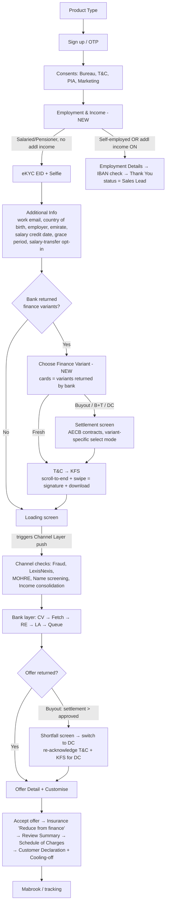

# B2B Personal Loan (PF) — Flow Summary for Super Portal Backend Design

| Item | Value |
|---|---|
| For | Huyen (PO) — input to Super Portal backend design |
| Sources | AMP-3694 (US Approved), AMP-3404 (US Approved), AMP-3732 (Ready To Clarify), AMP-3721 (Ready To Clarify), AMP-3748 (To Do), prototype `Appro_B2B_-_PF_Journey_Buyout__DC_offline_2.html`, SMBP KB 2026-09-26 |
| Date | 2026-09-27 |
| Evidence rule | Every rule cites a ticket. Anything not in a ticket is marked *(inferred)* or *(unverified)*. |

---

## 1. The four finance variants in one view

The B2B PL journey is one journey with **four Transaction Types**. Transaction Type is set **at product level** (single-select dropdown on Add Product, AMP-3721 AC1) and drives everything downstream: which screens appear, which pricing scheme applies, which settlement config is active, and which offer content is shown.

| | **New Finance (Fresh)** | **Buyout** | **Buyout + Top-Up** | **Debt Consolidation (DC)** |
|---|---|---|---|---|
| What it is | New loan, nothing settled. Full amount to customer's account. | Bank pays off **one** existing personal finance at another bank; customer moves the debt. Top-up = 0. | Buyout **plus** extra cash on top of the settlement. | Bank settles **multiple** liabilities (cards + loans + overdraft) into one instalment. |
| Settlement screen | **Skipped** (AMP-3694 AC6) | Shown — **single-select** (radio), CC hidden, unsecured instalments only (AMP-3732 AC3) | Same as Buyout, single-select, CC hidden (AMP-3732 AC3) | Shown — **multi-select** across all 3 AECB categories: CC, unsecured Instalments, NI/Overdraft (AMP-3732 AC2) |
| Availability gating | Always shown, cannot be disabled | ≥1 in-scope unsecured instalment contract AND `buyout_enabled` = ON | ≥1 in-scope unsecured instalment contract AND `buyout_topup_enabled` = ON | ≥1 in-scope CC contract AND `refinancing_enabled` = ON **AND all enabled hard gates G1–G5 pass** (AMP-3732 AC5) |
| Money to customer | Full approved amount | 0 extra (entire amount settles the contract) | Approved − settlement = top-up cash, capped at Max Top Up % (AMP-3721 AC3) | Usually 0 extra — amount = sum of settled contracts *(inferred; loan amount = MAX(min loan, Σ settlements), AMP-3732 AC6)* |
| Offer hero text | "You're approved for" | "You're **pre**-approved for" | "You're pre-approved for" + extra-cash banner | "You're pre-approved for" + monthly-savings banner (AMP-3404 AC6) |
| Contracts on offer detail | Hidden | "Contracts for buyout" — PL only, unselect allowed, ≥1 must remain, each reselection → bank recalculation | Same as Buyout | "Active contracts" — PL **and** CC, default toggled ON, same recalc rule (AMP-3404 AC6) |

**UAE market context (why these four exist).** CBUAE caps a personal loan at [20× salary, 48-month repayment, 50% DBR](https://rulebook.centralbank.ae/en/rulebook/article-2-personal-loan), and Regulation 29/2011 explicitly lets a borrower move a loan to another bank against an early-settlement fee of **max 1% of outstanding** ([CBUAE Rulebook, Reg. 29/2011](https://rulebook.centralbank.ae/en/rulebook/regulation-no-292011-regarding-bank-loans-other-services-offered-individual-customers)). That regulation created the buyout market: UAE banks (ENBD, ADCB, DIB, CBD…) all run "loan transfer/buyout" products where the new bank issues a manager's cheque to the old bank against a **liability letter**, often absorbing the 1% fee as an acquisition cost. Debt consolidation is the multi-contract version: it targets customers with several cards near their limits, where replacing ~36%-APR revolving card debt with a ~8–11% reducing-rate loan cuts the monthly outgo — that rate-arbitrage saving is exactly the "Save AED X/mo" banner in AMP-3404 AC6. *(Market colour beyond CBUAE rules is directional, not a verified benchmark table — Step 2 deep research can formalise it if needed.)*

---

## 2. Flow A — Long flow: Salaried / Pensioner, no additional income (AMP-3694)

Key backend decisions embedded in this flow:

| # | Rule | Source |
|---|---|---|
| 1 | **Product matching triggers at Pre-dedupe**, so variant cards are ready when the customer reaches the screen. | AMP-3694 notes |
| 2 | Variant cards are **not hardcoded** — display only what the bank returns (1 product per variant in Product Setup). No variant returned → skip Variant + Settlement + T&C + KFS straight to Loading. | AMP-3694 AC5 |
| 3 | **Channel Layer queue push is held** until the Loading screen — T&C/KFS moved pre-submission (from AMP-3404 Part 3). | AMP-3694 / AMP-3404 Part 1 |
| 4 | Settlement screen also skipped when AECB returns 0 or 1 contract (1 → auto-selected) or AECB timed out by Additional Info. | AMP-3694 AC6 |
| 5 | T&C and KFS: swipe enabled only after full scroll; swipe captures the client signature into the document; consent audit per AMP-2137/AMP-1734; document shown in DP Application Enquiry. | AMP-3694 AC7–AC8 |
| 6 | Expense validation: lifestyle expenses ≤ **X% of income, X configurable in BE** (was flat 100%). Income ≥ configurable min. | AMP-3694 AC1 |
| 7 | Islamic subtype wording: loan→finance, interest rate→profit rate. | AMP-3694 notes / AMP-3734 IA6 |
| 8 | B2B/B2C flag set in SAP at channel onboarding; B2B = 1 bank only, no offline banks. | AMP-3694 AC9, AMP-3713 |
| 9 | CRM sync only for Appro-channel applications. | AMP-3694 notes |

## 3. Flow B — Short exit "Sales Lead" (AMP-3694 AC1–AC3)

Trigger: **Self-employed**, or **Salaried/Pensioner with Additional Income toggled ON**, or income below configured minimum.

1. Employment Details screen: Full name, Company (BVE list + Others), IBAN (AE + 21 digits) — bank statement upload was **removed** (struck out in AC2).
2. **IBAN validated inline pre-submit** (AC2a): Submit enabled only on Pass.
3. Thank You screen: "our team will call you within 2 business days", reference number shown.
4. Status = **`Sales Lead`** (new SSS state — replaces Completed/Declined for these leads). eKYC, selfie, and everything after is **skipped**.

Backend impact: Super Portal needs `Sales Lead` in the status model, enquiry filters, and reports; the lead must surface to the channel/RM for the manual call-back. Audit trail steps: `Employment Type Selection`, `Employment Details Submission` (both new in CJ Description).

## 4. Flow C — Settlement & variant logic (AMP-3732)

**Two-layer availability check before the variant screen renders:**

- **Layer 1 — Hard gates (DC only), all configurable ON/OFF with thresholds:**

| Gate | Check | BP default (AMP-3732) | DP DC module default (AMP-2215) |
|---|---|---|---|
| G1 | Active facilities, Role = "A" (Holder) | ≥ 3 | ≥ 3 |
| G2 | Distinct providers (ProviderNo) | **≥ 2** | **≥ 3** ⚠ |
| G3 | Aggregate CC utilisation Σ Balance / Σ CreditLimit | **≥ 30%** | **≥ 70%** ⚠ |
| G4 | Clean payment history: no MaxDaysPaymentDelay ≥ 3 (60–89d), no blocked WorstStatus (17 statuses) | delay < 3 | DPD < 30 + keyword list ⚠ |
| G5 | Post-consolidation DBR | ≤ 50% | ≤ 50% (range 30–60) |

  ⚠ **The BP pre-filter defaults differ from the DP DC engine defaults on G2/G3/G4. Confirm with Gấu trắng whether this loosening is deliberate for B2B or a spec drift** — same class of problem as the DC scoring-vs-spec bugs (AMP-3456..3463).

- **Layer 2 — Contract gating:** in-scope contract = passes MLB-125 ECB filters (ActiveFlag="A", Role≠"G", FraudFlag≠"1", status exclusions) **AND** AMP-3732 filters (category toggle ON, type code in enabled list, seasoning ≥ 6 months default, SecuredContractFlag ≠ "Y" for instalments). MLB-125 hardcoded filters still apply (instalments ≤ 60 remaining; NI type 58), superseded by config (max tenor 60; NI types 60/63/100).

**Buyout shortfall → DC fallback** (AMP-3732 AC6 pre-check + AMP-3404 AC6a post-offer): if `Settlement Total > Approved Eligibility` → offer DC alternative; on accept: purpose switches to DC, pool expands to include CC, toggles reset, system **auto-selects contracts by highest cost-to-balance ratio** until the approved amount is filled; `loan amount = MAX(minimum loan amount, Σ selected settlements)`; T&C + KFS must be **re-acknowledged** for the DC product; all downstream values (pricing rate, LA, conditional offer) recalculated with new Transaction Type. Audit: `DC fallback flag` stored. Note: AMP-3732 AC6 is flagged in the ticket as a design extension needing its own Jira.

## 5. Terms explained (for backend vocabulary)

| Term | Meaning | Backend consequence |
|---|---|---|
| **Transaction Type** | Fresh / Buyout / Buyout + Top Up / Debt Consolidation — product-level attribute, inherited by all pricing schemes; also a Pricing Matrix factor for rate lookup and (planned) an RE segmentation/filtration variable. | One product row per variant; rate lookup key; strategy split per variant (AMP-3721 AC1, IA2–IA3). |
| **Settlement** | Paying off the customer's existing contract(s) at other banks directly from the new loan. | Per-contract settle flag, bank name (mandatory when ON, AMP-3433), settlement total; funds never reach the customer for the settled part. |
| **Liability / Settlement letter** | Letter from the existing lender stating the exact outstanding to settle. Validity configurable 1–365 days; expired letters flagged in processing. | `Settlement Letter Validity (Days)` per pricing scheme + expiry check job (AMP-3721 AC2). Market: letters typically valid 15–30 days *(market practice, unverified)*. |
| **FSTL** | First Salary Transfer Letter — pricing-scheme factor Yes/No: whether the scheme requires the salary-transfer letter for the buyout flow. | New PM Step-2 factor; drives document checklist and rate row (AMP-3721 AC1). |
| **Early Settlement Absorption %** | Share of the **old** bank's early-settlement fee the **new** bank absorbs (0% = customer pays; 100% = added to facility). CBUAE caps the old bank's fee at 1% of outstanding. | Per-scheme 0.00–100.00%; feeds Total Buyout Amount (AMP-3721 AC2, IA1). |
| **Top-up** | Extra cash above the settlement, only in Buyout + Top Up. Capped by `Max Top Up %` of approved facility; optional purpose declaration toggle. | Validation + optional purpose field (AMP-3721 AC3). |
| **In-scope contract** | AECB contract that passes both MLB-125 and AMP-3732 filters — the only ones selectable for settlement. | Deterministic filter pipeline; out-of-scope contracts optionally shown read-only with EXCLUDED badge (`show_excluded_contracts`). |
| **Hard gates G1–G5** | Binary DC pre-qualification checks on the full AECB report (see §4). | Config card in AECB Contract Scope Configuration (AMP-3753); evaluated at variant-selection time. |
| **Sales Lead** | New terminal-ish SSS state for manually-handled leads (self-employed, additional income, low income). | Status model + queue/report surface. |
| **Grace period** | Days before the first instalment; CJ range = MIN(banks' min)–MAX(banks' max), fallback 30–99; grace interest accrues into the schedule. | AMP-2269, AMP-3306, AMP-3331. |
| **Cooling-off** | CBUAE Consumer Protection: 5 complete business days after signing, waivable in writing — default in our declaration screen is **unticked = waived** (AMP-3404 AC11–AC12). | Pause state + resume timer + notifications. AC12 has three empty behaviour sections ("When applied / ends / waived") — **spec gap**. |

## 6. Calculation formulas (backend-ready)

All verified against tickets; notation: `P` principal, `R` annual rate, `N` tenor months.

| # | Formula | Source |
|---|---|---|
| F1 | **EMI** = `P × (R/12) × (1+R/12)^N / ((1+R/12)^N − 1)` | AMP-11 |
| F2 | **Loan Tenor** = `min(300, AgeLimit×12 − Age×12 − 1)` — generic CB Notice 31/2012 rule. For PL the product Max Tenor must also respect the CBUAE 48-month cap ([Art. 2](https://rulebook.centralbank.ae/en/rulebook/article-2-personal-loan)) — enforce via Product Setup Min/Max Tenor. | AMP-2239 |
| F3 | **PL Max Eligibility** = `abs(−(DBR Room × (1 − (1+Base/12)^(−Tenor))) / (Base/12))` — i.e. PV of the monthly DBR room over the tenor. | AMP-2239 |
| F4 | **DBR Room** = `MaxDBR% × Finalized Income − existing monthly obligations`; Max DBR ≤ 50% (CBUAE); multiple segment groups pass → lowest approved limit wins; (C) = min(rule-based A, liability-based B). | AMP-680, AMP-426, AMP-653 |
| F5 | **Monthly obligation per AECB contract**: CC = `MAX(CC% × CreditLimit, CC% × Balance)`; NI/OD = `MAX(NI% × CreditLimit, NI% × Balance)`; Instalment = `PaymentAmount` (no %). CC%/NI% configurable in AECB Contract Scope. | AMP-3732 AC4, AMP-2327 |
| F6 | **Total Buyout Amount** = `Settlement Amount + Absorbed Early-Settlement Fee + Top-Up Amount`, where Absorbed ES Fee = `min(1% × outstanding, old-bank fee) × Absorption%` *(1% cap per CBUAE Reg. 29/2011; absorption per scheme)*. New CV variables: Settlement Amount, Top Up Amount, Total Buyout Amount. | AMP-3721 IA1 + CBUAE |
| F7 | **Top-up validation**: `Top-Up ≤ MaxTopUp% × Approved Facility`; also `Top Up available = Approved Amount − Settlement Amount`. | AMP-3721 AC3, AMP-3732 IA1 |
| F8 | **Settlement caps**: `Settlement Total ≤ Maximum Settlement Amount` (per scheme, else manual review); `Settlement Total ≤ Approved Eligibility` (else DC fallback). | AMP-3721 AC2, AMP-3732 AC6 |
| F9 | **DC auto-selection**: rank in-scope contracts by cost-to-balance ratio desc, select until `Σ balances ≤ Approved Eligibility`; `Loan Amount = MAX(min loan amount, Σ selected)`. | AMP-3732 AC6 |
| F10 | **DC current rate per instalment contract** = `RATE(n, pmt, −Total, 0, 0, 0.01) × 12` (frequency-converted). | AMP-2326 |
| F11 | **DC new EMI (per bank)** = `PMT(MinRate/12, MinTenure, Σ in-scope balance × 1.05)` (5% buffer); **Post-consolidation DBR** = `(New EMI + out-of-scope obligations) / final income` — this feeds gate G5 and the "Save AED X/mo" banner (`Save = Now − After`). | AMP-2328, AMP-2329 |
| F12 | **Insurance premium**: Fixed AED, or `Standard% × Selected Finance Amount`; B2B = "Reduce from finance" only (deducted, never paid upfront). | AMP-3404 AC8 |
| F13 | **Net Amount Credited** = `Approved/Selected Amount − Processing Fee − Insurance Premium (if selected) − Settlement Amount (Buyout/DC)`. Processing fee: if % from bank, apply the same convert-then-deduct logic as insurance. | AMP-3404 AC9 |
| F14 | **7 Consolidated Variables** (Consolidated EMI-Instalment, Limit-CC, Limit-Instalment, Limit-NI, OS Bal-CC, OS Bal-Instalment, OS Bal-NI) are **recalculated after settlement selection** — settled contracts are zeroed/overridden before LA re-runs (same mechanism as Conditional Offer). | AMP-3732 IA1, AMP-1985/1987 |

**Worked example** *(illustration only, prototype-consistent)*: income 25,000; obligations 4,000 (CC limit 60,000 → 3% = 1,800 + EMI 2,200). DBR room = 50%×25,000 − 4,000 = 8,500/mo. At 5.49% base, 48 months → F3 gives Max Eligibility ≈ 365,000, capped by product max. Customer selects Buyout of an 82,400 outstanding PL + 40,000 top-up: F6 total = 82,400 + (1%×82,400×100% absorption = 824) + 40,000 = 123,224 ≤ approved → proceed; else DC fallback.

## 7. What the Super Portal backend must provide (design checklist)

| Area | Requirement | Source |
|---|---|---|
| Product Setup | Transaction Type dropdown at product level; Settlement Configuration (letter validity, max settlement, absorption %); Top-Up config; FSTL PM factor; PM template +6 columns with per-row overrides & upload validation (ET33 on error); Product T&C upload; Document Checklist (13 predefined docs, select + mandatory toggle). | AMP-3721 |
| Fetching API | Active PL products per channel → dedupe distinct Transaction Types into purpose cards; return features, amount/tenor range, min salary, age limit, document checklist, T&C PDF. No eligibility filtering pre-submission. | AMP-3748 |
| AECB Contract Scope config | Category toggles, type codes, seasoning, secured flag, CC%/NI%, purpose toggles (`buyout_enabled`, `buyout_topup_enabled`, `refinancing_enabled`), hard-gate card, `show_excluded_contracts`. Defaults apply when unconfigured (all ON, seasoning OFF, secured excluded). | AMP-3753, AMP-3732 IA4 |
| Offer recalculation API | Every contract reselection, Customise "Apply changes", and DC fallback → send to bank, recalc rate/EMI/limit; handle calc-failure message; enforce ≥1 contract selected. | AMP-3404 AC6/AC6a |
| Status & audit | `Sales Lead` state; new steps: Employment Type Selection, Employment Details Submission, Finance Variant Selection, Contract Settlement, T&C/KFS/SoC/Declaration acknowledgements, Cooling-Off Period Started, DC-fallback events; variant + DC-fallback flag on the application record; documents visible in DP Application Enquiry. | AMP-3694, AMP-3404, AMP-3732 AC8 |
| Cooling-off engine | Pause on ticked cooling-off, resume after 5 business days, notifications on apply/end/waive. | AMP-3404 AC12 |
| ETL / STL inputs | Salary-transfer opt-in conditional on ETL (AMP-3717); STL data extraction (AMP-3743); document mapping (AMP-3728); ETL validations & daily backup (AMP-3754/3755). | linked stories |

## 8. Open points to resolve before backend design freezes

1. **G2/G3/G4 defaults differ between BP pre-filters (AMP-3732) and the DP DC engine (AMP-2215)** — deliberate B2B loosening or drift? (§4)
2. **AMP-3732 AC6 (shortfall pre-check) vs AMP-3404 AC6a (post-offer fallback)** — the shortfall check exists in both places with different trigger points (Confirm Settlement vs offer return). Confirm which is authoritative, or whether both run. AC6 itself says a dedicated ticket is still to be created.
3. **Cooling-off AC12 behaviour sections are empty** (applied / ends / waived) — notifications and resume behaviour unspecified.
4. **DC settlement amount vs customer cash**: for DC, is loan amount always exactly Σ settlements (no cash-out)? AMP-3732 AC6 implies yes for fallback; not stated for direct DC selection. *(gap)*
5. **48-month CBUAE tenor cap** is not asserted anywhere in the stories — F2 allows up to 300 months generically; only Product Setup Min/Max Tenor protects compliance. Recommend an explicit platform validation for PL.
6. **Fee caps in the prototype KFS (processing 1.05% incl VAT min 525 / max 2,625; early settlement 1.05% / cap 10,500)** match the market pattern of "1% + VAT, cap AED 10,000 + VAT" but I could not open CBUAE Appendix 2 from this environment to verify the caps verbatim — treat as *(unverified)* until checked against the Appendix 2 PDF.
7. AMP-3732, AMP-3721, AMP-3748 are **not yet approved** (Ready To Clarify / To Do) — backend design based on them should track their clarification outcomes.

---
*Sources: Jira tickets cited inline (scvaladdin.atlassian.net); [CBUAE Rulebook — Personal Loan, Art. 2](https://rulebook.centralbank.ae/en/rulebook/article-2-personal-loan); [CBUAE Reg. 29/2011](https://rulebook.centralbank.ae/en/rulebook/regulation-no-292011-regarding-bank-loans-other-services-offered-individual-customers); [CBUAE Consumer Protection Standards](https://rulebook.centralbank.ae/en/rulebook/consumer-protection-standards).*
