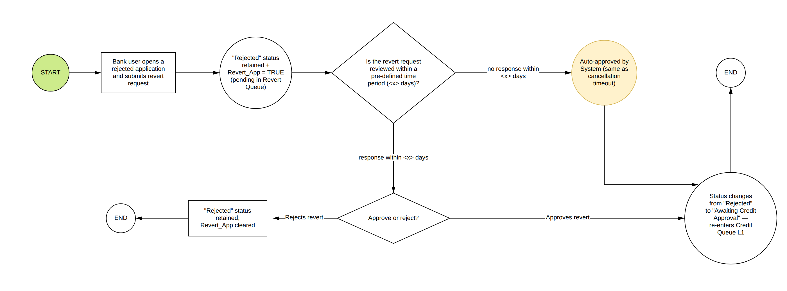
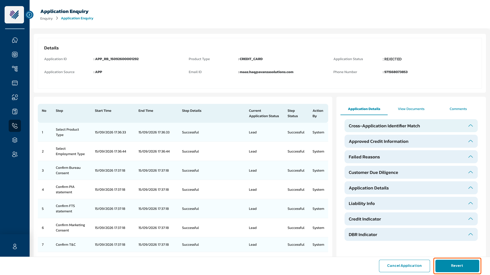
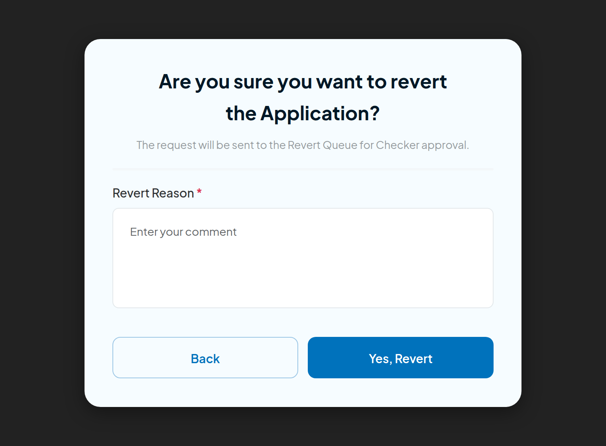
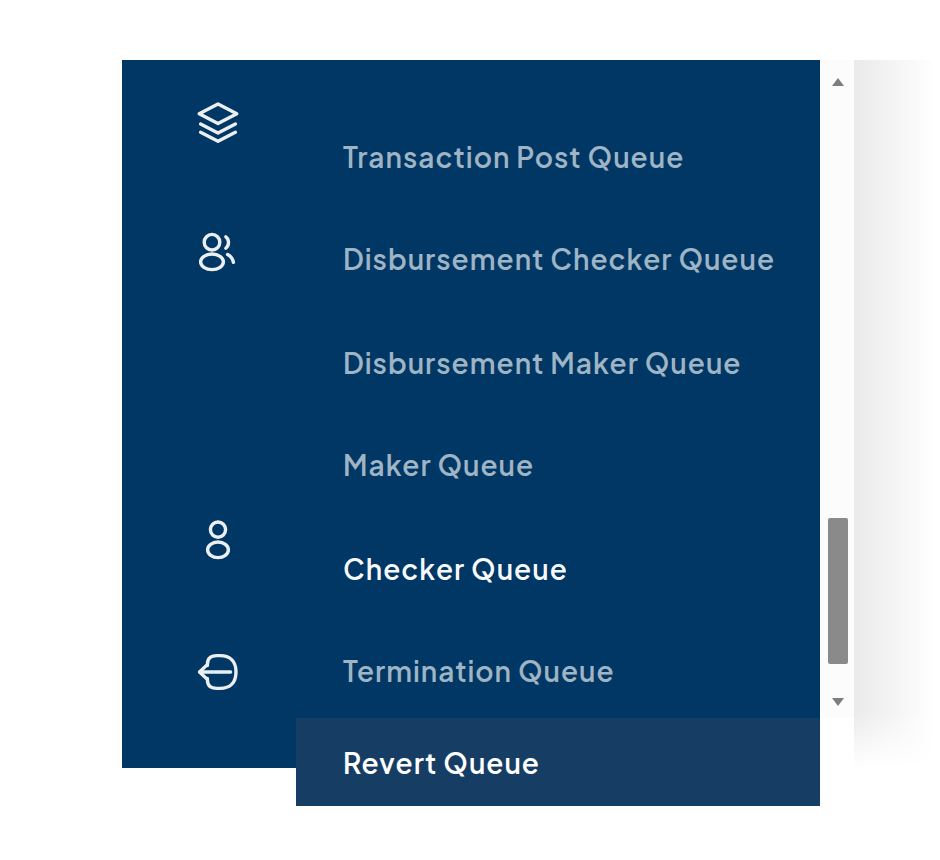
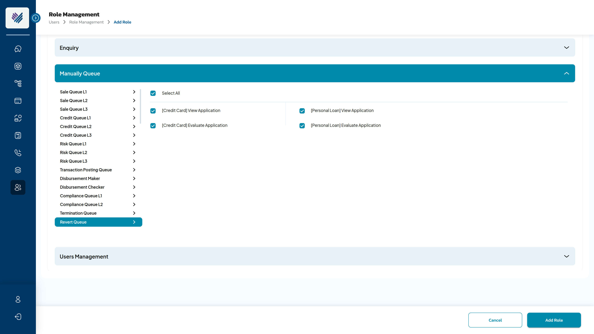
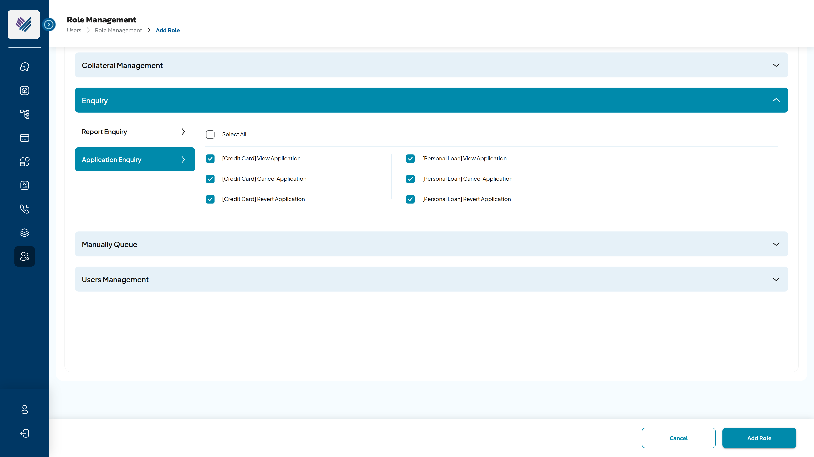
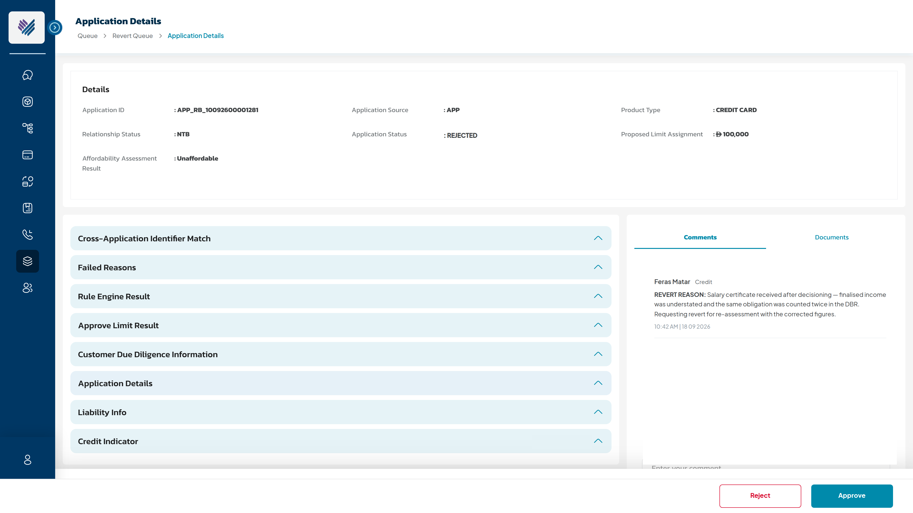

# [Enhancement] Revert rejection case — RF-3305

*User story pre-populated for RF-3305, mirroring the structure of RF-2365 (Application Cancellation on Application Enquiry screen). Companion BRD: **Application Revert in Super Portal V1.0** (attached to the ticket).*

---

## Context of Business

* Today a rejection in Super Portal is **final**. The Pre-dedupe *Existing Application Check* then blocks any new application for the same customer for **30 days** after a rejection — and that block has reached across products in production. When Credit rejects a case on a parameter that was wrong, incomplete or has since been corrected (income evidence arriving late, an obligation double-counted, a decision boundary re-tuned), the customer cannot simply reapply; the only remedy inside the window is to reopen the same application.
* This story provides a manual option to **revert a rejected application back to Credit Queue**, through the Super Portal interface, so the responsible team can correct the credit parameters and re-decision the case. It is requested by the Credit Department and follows the **same maker–checker governance as Application Cancellation** (RF-2365 / RF-2366 / RF-2367).
* **Signed off BRD:** *Application Revert in Super Portal V1.0* (attached; to be filed under 5. [RF] Phase 2 Documents).

## User Story Details

* The existing **Application Enquiry** module in the Super Portal will be utilized to support the bank's requirement for reverting rejected applications — mirroring the entry point of RF-2365.
* **Scope: Credit Card and Personal Loan only.** CASA is excluded (no credit decisioning); Mortgage Loan and Auto Loan are not yet part of the platform scope.
* **Scope rule — Credit root cause only:** revertible rejections are those **rejected by Credit** in Credit Queue, or **auto-rejected by the System for credit reasons** (DBR safety nets, segmentation failure, approved limit below Min Boundary). Compliance, Risk and Sale queue rejections are **out of scope**.
* This story carries the three parts of the cancellation set in one ticket — Enquiry screen (≈RF-2365), Role Management (≈RF-2366) and the checker queue (≈RF-2367). Split into companion stories at refinement if preferred.
* Screens: **SC1–SC6 + flow** — attached to this ticket as `SC1_Role_Permission_Application_Enquiry.png` (SC1 Role Management > Application Enquiry permissions), `SC2_Application_Enquiry_Revert_Button.png` (SC2 Application Enquiry with Revert button), `SC3_Revert_Confirmation_Popup.png` (SC3 Revert confirmation popup), `SC4_Queue_Menu_Revert_Queue.png` (SC4 Queue menu with Revert Queue), `SC5_Role_Permission_Revert_Queue.png` (SC5 Role Management > Manually Queue > Revert Queue), `SC6_Revert_Queue_Approve_Reject.png` (SC6 Revert Queue application details with Approve / Reject), `Flow_Application_Revert.png` (end-to-end flow). The same images are embedded in the BRD. Figma to follow from design; SC images are build-accurate composites over the live UAT portal in the interim.

### End-to-end flow

## Acceptance Criteria

### AC1: Application Revert Screen Description

**SC2 – Application Enquiry > Application Details screen** (`SC2_Application_Enquiry_Revert_Button.png`)

**SC3 – Revert Confirmation Popup** (`SC3_Revert_Confirmation_Popup.png`)

| Name | Component Type | Mandatory | Editable | Description |
| --- | --- | --- | --- | --- |
| Revert Button | Button | NA | NA | User with "[Product] Revert Application" role permission should be able to view the "Revert" button on the Application Details screen, next to the existing "Cancel Application" button. **Enabled only when Application Status = "Rejected" AND the rejection origin is revertible per AC5 AND no revert request is already pending (Revert_App = FALSE).** Disabled (greyed) otherwise. |
| Revert confirmation (Are you sure you want to revert the Application) | Modal popup | NA | NA | SC3: User should confirm the revert request. Sub-text: "The request will be sent to the Revert Queue for Checker approval." Click on **Yes, Revert** to submit the request and enter the Revert Reason for approval from Checker (see AC1.1). Click on **Back** to close the popup with no change. |

| Product Type | Applicable Status for Revert in Super Portal |
| --- | --- |
| CC | Rejected — where the rejection origin is revertible per AC5 |
| PL | Rejected — where the rejection origin is revertible per AC5 |

The revert shall be restricted in below scenarios:

| Scenario | Condition / Application Status |
| --- | --- |
| Bank users already initiated revert | Revert_App = TRUE (revert request pending in Revert Queue) |
| Rejection has no Credit root cause | Rejected by Compliance Queue, Risk Queue or Sale Queue — only Credit-root-cause rejections are revertible (rejected by Credit, or auto-rejected by the System for credit reasons) |
| Application is not rejected | Any Application Status other than 'Rejected' (Lead, In Progress, Awaiting * , Approval In Principle, User Initiated Cancellation, Completed, …) |
| Application terminated for another reason | Invalidate \| Insufficient Data \| Declined \| Cancelled \| Failed by Minimum Income \| Expired \| Blocked \| Failed By EFR |
| Rejection origin is not revertible | Pre-dedupe check failure (Step 7.1) \| No applicable product ({Pre-Fetch Applicable Product}) \| AML blacklisted / AML callback rejected \| geo-fencing, EID-scan or EFR liveness terminations |

### AC1.1: Revert Reason

* **Save Revert Reason as Comment**
  * When user enters the mandated Revert Reason field and clicks on "Yes, Revert" button:
    * The Revert Reason text will be displayed on Comment area with below details:
      * Comment title: \<\<User's name posted comment\>\> \<\<Department name\>\>
      * Comment body: "REVERT REASON: \<Content of Revert Reason inputted\>"
      * Comment footer: \<\<Posted Date time\>\> (format hh:mm AM/PM | DD MM YYYY)
    * Save comment to DB with prefix "REVERT REASON" — format: REVERT REASON: \<revert reason comment text\>
    * Store basic audit trail — refer to **CR 003** (RF Common Rule).

### AC2: Impact of user submitting the Revert request

**AC2.1: Revert request by Bank user from the Application Enquiry**

When user submits the revert request:

* **Revert_App = TRUE** (new flag, mirroring the existing Cancel_App flag)
* **Application Status remains "Rejected"** — no new application status is introduced. The application is not changed by the request, only by the Checker decision. *(Deliberate difference from cancellation's 'User Initiated Cancellation': the application is already terminated, and every new status must be handled by the mobile app.)*
* The **target queue and status** are resolved per AC5 at submission time and stored on the request. Re-entry is **always at Level 1** of the target queue — in this scope always 'Awaiting Credit Approval', Credit Queue L1.
* The below [Application History] object logs — stored as audit trail and displayed under Application Enquiry details:
  * [Application ID] = \<current Application ID\>
  * [Step] = "Manual revert process"
  * [State] = "Rejected"
  * [Start Time] / [End Time] = yyyy-MM-dd HH:mm:ss
  * [Step Status] = "Successful"
  * [Step Detail] = "Revert requested by %Username% to \<TARGET_QUEUE\>. Revert reason is \<REVERT_REASON AC1.1\>"
  * [Action by] = \<user email id\>

**AC2.2: Landing the revert request into Revert Queue (Checker)**

* A new queue, **'Revert Queue'**, appears in the Queue menu alongside the existing queues (SC4, `SC4_Queue_Menu_Revert_Queue.png`), and under the **Manually Queue** section in Role Management (Add Role screen) with two role permissions per product — **View Application** and **Evaluate Application** ([Credit Card] / [Personal Loan]) (SC5, `SC5_Role_Permission_Revert_Queue.png`).

* Role Management also gains **'[Credit Card] Revert Application'** and **'[Personal Loan] Revert Application'** under **Enquiry > Application Enquiry** (Maker permission — mirrors RF-2366) (SC1, `SC1_Role_Permission_Application_Enquiry.png`). These are distinct permissions, kept separate from Cancel Application and from Evaluate Application (RF-2781 / RF-2785 precedent).

* Revert Queue details view (SC6, `SC6_Revert_Queue_Approve_Reject.png`) = same layout as Termination Queue details (RF-2367): application detail sections, **Comments tab selected by default** (so the REVERT REASON comment is the first thing the Checker sees), Documents tab. The Checker view is read-only apart from the decision — no Edit / Override / Send / FTS Retrigger here.

* **Approve** ('Are you sure you want to Approve the application revert?' → Yes, Approve):
  * Application Status changes from "Rejected" to **"Awaiting Credit Approval"** and the application re-enters **Credit Queue at Level 1**; Revert_App = FALSE
  * Toaster: "Revert of \<Application ID\> is approved"; update [Revert Queue] = 'APPROVED' → remove from queue
  * Audit: [Step] = "Revert Queue", [State] = "Awaiting Credit Approval", [Step Detail] = 'Application revert requested by "%Username%" and approved by "%Username%". Application returned to Credit Queue L1', [Action by] = \<System\>
  * Email notification per AC3 to the requesting bank user
* **Reject** ('Are you sure you want to Reject the application revert?' → Yes, Reject):
  * Application Status remains "Rejected"; Revert_App = FALSE (a fresh request may be raised later)
  * Toaster: "Revert of \<Application ID\> is rejected"; update [Revert Queue] = 'REJECTED' → remove from queue
  * Audit: [Step] = "Revert Queue", [State] = "Rejected", [Step Detail] = 'Application revert requested by "%Username%" and rejected by "%Username%"', [Action by] = \<System\>
  * Email notification per AC3
* Maker–checker segregation follows the **same model as Application Cancellation** — no additional restriction is introduced (PO decision).

**AC2.3: Automatic Revert Approval Post Revert Timeout**

Mirrors RF-2365 AC2.3 (Automatic Application Termination Post Cancellation Timeout). When the bank user initiates the revert of an application, a predefined time period [X] days will begin ([X] is configurable in database; the cancellation timeout is currently set to **5 days**):

| Scenario | Outcome |
| --- | --- |
| Request APPROVED in Revert Queue within [X] days | Per AC2.2 Approve — status changes from "Rejected" to "Awaiting Credit Approval", application re-enters Credit Queue L1 |
| Request REJECTED in Revert Queue within [X] days | Per AC2.2 Reject — application remains "Rejected" |
| No decision within [X] days | The request is **auto-approved by the System** the next day after timeout — same behaviour as the cancellation timeout: Application Status changes from "Rejected" to **"Awaiting Credit Approval"**, the application re-enters **Credit Queue at Level 1**, Revert_App = FALSE, removed from Revert Queue, email as per AC3 (approved). Audit: [Step] = "Auto Revert Approval on timeout" (mirrors "Auto Cancellation on timeout"), [State] = "Awaiting Credit Approval", [Step Detail] = 'Application revert requested by "%Username%" and approved by System, as per approval timeout configuration of [X] days. Application returned to Credit Queue L1', [Action by] = \<System\> |

### AC3: Sending Email Notification

* When the revert request is decided, send email notification to the bank user who requested the revert (Bank-type templates, English only, per product — CC and PL):

| Type | Subject | Content | Trigger |
| --- | --- | --- | --- |
| Email | [Super Portal] - Application %%APPLICATION_ID%% revert is approved. | Dear %%USER_NAME%%, Please be informed that your request to revert the application %%APPLICATION_ID%% has been approved. The application status has changed from 'Rejected' to 'Awaiting Credit Approval' and the application has been returned to Credit Queue. Best Regards, Reem Bank | One time — send immediately when the revert is approved in Revert Queue, or auto-approved by System on timeout |
| Email | [Super Portal] - Application %%APPLICATION_ID%% revert is not approved. | Dear %%USER_NAME%%, Please be informed that your request to revert the application %%APPLICATION_ID%% is rejected. The application remains Rejected. Best Regards, Reem Bank | One time — send immediately when the revert is rejected by Checker in Revert Queue |

* **New Customer-type template — approval after re-assessment** (the customer is informed only at final confirmation, per AC4; mirrors the standard approval message):

| Type | Subject | Content | Trigger |
| --- | --- | --- | --- |
| Email (Customer) | Reem Bank — Update on your application %%APPLICATION_ID%% | Dear %%CUSTOMER_NAME%%, Following a further review of your %%PRODUCT_TYPE%% application %%APPLICATION_ID%%, we are pleased to inform you that your application has been approved. No action is required from your side — we will be in touch with the next steps to complete your application. Thank you for choosing Reem Bank. Best Regards, Reem Bank | One time — when an application reopened via an approved revert is approved after re-assessment |

* All merge fields must resolve before dispatch; templates sign off as **Reem Bank** (not Reem Finance).

### AC4: Customer Journey after revert

* **While the request is pending:** nothing changes for the customer — the application is still Rejected and the 30-day pre-dedupe block continues to apply.
* **After an approved revert:** the application is in-flight again in a queue; the pre-dedupe *in-progress application* check blocks a new same-product application (correct). Resuming the journey must land the customer at the correct point — regression on resume behaviour (RF-3271-type gaps).
* **If the application is rejected again after a revert:** the 30-day re-application window **restarts from the latest rejection** — the countdown begins again at the new rejection date.
* **Customer communication — final confirmation only:** the customer is **not** notified of the reopen (the rejection notification ET8/ET12 was already sent at the point of decision). The customer is informed only when the re-assessment completes: on approval, the new Customer-type template in AC3 is sent — the same message as a normally approved application; on a repeat rejection, the standard rejection notification applies and the 30-day window restarts.
* **No cap** on the number of reverts per application in v1.

### AC5: Revert trigger points and target status determination

Revertibility is derived from **how it became Rejected** — from the audit step recorded at the point of rejection. Only **Credit-root-cause** rejections are revertible, so in this scope the target is always **'Awaiting Credit Approval' — Credit Queue Level 1** (PO decision); the case then escalates through levels under the standard queue rules. No new data capture is required.

| Audit step recorded at rejection | Rejection origin | Revertible | Target status (and queue) |
| --- | --- | --- | --- |
| {Rejected in Credit Queue [Level]} | Credit user rejects in Credit Queue L1–L3 | Yes | Awaiting Credit Approval — Credit Queue **L1** |
| {Safety net for Finance DBR} | System auto-reject — Existing DBR > 50% after calculation | Via parking change below | Awaiting Credit Approval — Credit Queue L1 |
| {Safety net for Gross DBR} | System auto-reject — Gross DBR > 100% | Via parking change below | Awaiting Credit Approval — Credit Queue L1 |
| {Fail Strategies Check} | System auto-reject — application fails all segmentations (rejection logic unchanged) | Yes | Awaiting Credit Approval — Credit Queue L1 |
| Approval Limit Result = "Failed" | System auto-reject — approved limit < Min Boundary with no deviation (rejection logic unchanged) | Yes | Awaiting Credit Approval — Credit Queue L1 |
| Compliance Reject | Compliance user rejects in Compliance Queue L1–L2 | No — out of scope | — (no Credit root cause) |
| Risk Reject | Risk user rejects in Risk Queue L1–L3 | No — out of scope | — (no Credit root cause) |
| Sale Reject | Sales user rejects in Sale Queue | No — out of scope | — |
| {Pre-Fetch Applicable Product} / pre-dedupe steps / AML | System terminations before any queue ownership | **No** | — |

* **System change — DBR parking (confirmed, both safety nets):** today, a breach of **Existing DBR > 50%** after calculation or of **Gross DBR > 100%** auto-rejects the application with [Action by] = \<system\> (RF-1041 safety nets), leaving no previous status to restore. The system shall instead **park the case into Credit Queue L1** ('Awaiting Credit Approval') for both safety nets: the **Failed Reason continues to show the same message** as the current auto-rejection, and the system shall **complete the Rule Engine run and Limit Assignment** so the RE result and limit-assignment result are available in the Credit Queue view — the Credit user must have enough information to decide. A subsequent Credit rejection then reverts under the standard rule. This parking applies to every safety-net breach, not only cases later reverted — Credit Queue volume impact to be sized during estimation.
* **No change to the other auto-rejections (confirmed):** "fails all segmentations" and "approved limit < Min Boundary" keep their current auto-rejection logic — no parking is introduced for them. A revert of such a case returns it to Awaiting Credit Approval — Credit Queue L1, where a Credit user takes ownership of the re-decision.

## Impact Analysis

| Area | Impact |
| --- | --- |
| Role Management / Permission Matrix | **6 new permissions, per product:** [CC]/[PL] × Revert Application (Enquiry > Application Enquiry); [CC]/[PL] × View Application + Evaluate Application (Manually Queue > Revert Queue). Permission Matrix page to be updated. Distinct rights — never bundled. |
| Queue model / drop points | New **Revert Queue** in the Queue menu and the Manually Queue role section. Drop-points matrix: approved revert → **Credit Queue L1**; parking of **both DBR safety nets** (Existing DBR > 50%, Gross DBR > 100%) → Credit Queue L1 — **volume increases for every breach**, not only reverted cases. Parked cases carry the completed Rule Engine + Limit Assignment results into the queue view. |
| Status model / mobile app | No new Application Status (**Revert_App flag** only) → **no mobile app change**; avoids status-not-reflecting-reality defects. |
| Audit trail | 3 new steps — "Manual revert process", "Revert Queue", "Auto Revert Approval on timeout" (mirrors cancellation's "Auto Cancellation on timeout"). The original rejection record is never modified. |
| Communication Setup | 2 new **Bank-type** templates per product (revert approved / not approved) + 1 new **Customer-type** template (approval after re-assessment, mirrors the standard approval message — AC3). Compliance / Risk reject confirmation texts stay as-is (those rejections remain non-revertible). |
| Reporting / MIS | WIP, Exception, Policy Exception, E2E and Approved Transactions must handle reopened cases (rejection counts become mutable; E2E must not double-count) — walk through with the reporting owner during refinement. |
| Services | backoffice-service, application-service, queue-service, user-service, audit-trail-service, notification-service, scheduler-service (timeout job), **work-flow-service (Camunda — the key estimation item: resume the terminated process instance vs re-instantiate at the queue task)**. |
| Credit policy / re-decisioning | Post-revert re-runs evaluate against the **currently published** strategy / score check / income multiplier versions; the audit trail records which version applied. |

## Out of scope

* CASA (no credit decisioning), Mortgage Loan, Auto Loan.
* Rejections with no Credit root cause: **Compliance Queue, Risk Queue and Sale Queue rejections**; pre-decision terminations (geo-fencing, EID scan, EFR liveness, pre-dedupe, no applicable product, AML).
* Post-offer stages: AIP expiry, KFS/DDA signature stages, any application where a core-banking API has been triggered.
* Bulk revert; a cap on the number of reverts per application; editing the application inside the Revert Queue; SLA/TAT on the Revert Queue (the AC2.3 timeout is a scheduler job, not an SLA); reversal of a Checker decision; customer notification at the point of reopen (final confirmation only — AC4).
