# [Enhancement] Credit Queue – Employer Name edit with ALOC & Rule Engine re-run — RF-3309

*User story pre-populated for RF-3309, mirroring the structure of the existing Credit Queue edit stories (RF-1492 Edit Length of Service, RF-2682 Edit Other Income and Expenses) and the governance shapes of RF-3305 (Application Revert). Source: **RF Appro September 2026 Combined List – Item 3** (Change Request, Credit Department). Cost approval required before implementation.*

---

## Context of Business

* Today the Employer Name of an application is **system-derived and locked**: [Finalized Employer Name] = EFR 1.12 [Sponsor Name] for Mainland / Freezone visas, or the Employer Name the customer selects or types in the Customer Journey for GCC / Golden / Family visa (RF-174 AC2, RF-8 / RF-18). No bank user can correct it in the Super Portal.
* The Employer Name is a **credit-decisioning input**, not only a display field. It drives the ALOC / N-ALOC classification and the Employer Category, Sector, Industry and Employer Status pulled from the Empaneled Company list (RF-424 AC3, RF-869 AC2–AC3, Rosette match ≥ 0.9), the MOD / MOI / Pensioner flags (RF-424 AC2), the Industry / Sector attributes of Segmentation and Filtration (RF-1896) and, through the classification, the maximum DBR used by Limit Assignment.
* Wrong or non-matching employer names are a recurring production pattern: the EFR sponsor name differs from the trading name held in the ALOC list, the customer-typed name ("Others") contains typos or Arabic, or the customer picked a look-alike BVE entry. Drop point 12 — *Have different Employer Name than value get from EFR* — already parks such cases in Credit Queue L1 ([RF] Drop points to Queue). The Credit user can **see** the wrong employer but cannot **fix** it: today the only options are to decide on N-ALOC terms or to reject.
* This story adds **Employer Name as a new editable section of the existing Edit Application pop-up in the Credit Queue**. On save the system overrides the finalized Employer Name, re-runs the employer classification (ALOC), recalculates the related fields, re-runs the Rule Engine and displays the recalculated results in the application details — the same edit → recalculate → re-run → route pattern as RF-1492 and RF-2682. Requested by the Credit Department.

## User Story Details

* **As a** Credit Queue user with the "Edit Employer Name" permission, **I want** to correct the Employer Name of an application while it sits in Credit Queue (L1–L3), **so that** segmentation, eligibility and limit assignment reflect the true employer before I decide the case.
* **Scope: Credit Card and Personal Loan only.** CASA is excluded (no credit decisioning). Mortgage Loan has its own Credit Queue edit story (RF-2957) and is not covered here.
* **Entry point:** the existing **Edit** button on Credit Queue › Application Details (L1, L2, L3). The section is available exactly when the Edit button is available today — application in Credit Queue (`Awaiting Credit Approval`), not waiting for FTS income (RF-265 AC3), not locked by another request (RF-2682 AC2 step 8).
* **In-scope scenarios** (the plain list):
  * **E1** — EFR [Sponsor Name] (Mainland / Freezone) differs from the legal / trading name held in the Empaneled Company list → Credit user overwrites it with the listed name → application becomes ALOC with its Category / Sector / Industry.
  * **E2** — Customer-typed Employer Name (GCC / Golden / Family visa, "Others" free text in the journey) is wrong, misspelt or Arabic → Credit user corrects it.
  * **E3** — Employer genuinely not in the Empaneled Company list → Credit user corrects the name anyway → classification stays N-ALOC; the corrected name flows to the application details and the generated documents.
  * **E4** — Application returned to Credit Queue L1 through an approved Revert (RF-3305) → Employer Name corrected before the re-decision.
* **Not in scope:** editing the Employer Name from Application Enquiry or from Risk / Compliance / Sale queues; editing Employment Category / Employment Type; re-running Length of Service (it has its own edit section, RF-1492); re-fetching EFR / AECB / MOHRE; Arabic input in the Super Portal; BVE integration in the Super Portal. See *Out of scope*.
* **Screens: SC1–SC6 + flow** — attached to this ticket as `SC1_Role_Permission_Credit_Queue_Edit_Employer_Name.png` (Role Management › Manually Queue › Credit Queue L1 with the new permission), `SC2_Credit_Queue_Application_Details_Edit_Button.png` (Credit Queue application details, Edit entry point), `SC3_Edit_Application_Popup_Employer_Name.png` (Edit Application pop-up with the new Employer Name section), `SC4_Edit_Employer_Name_Confirmation_Popup.png` (confirmation before the re-run), `SC5_Application_Details_Employer_Name_Updated.png` (Application Details after the update), `SC6_Application_Enquiry_History_Edit_Employer_Name.png` (Application Enquiry history with the audit step), `Flow_Edit_Employer_Name.png` (end-to-end flow). SC images are build-accurate composites over the live UAT portal; Figma to follow from design.

### End-to-end flow

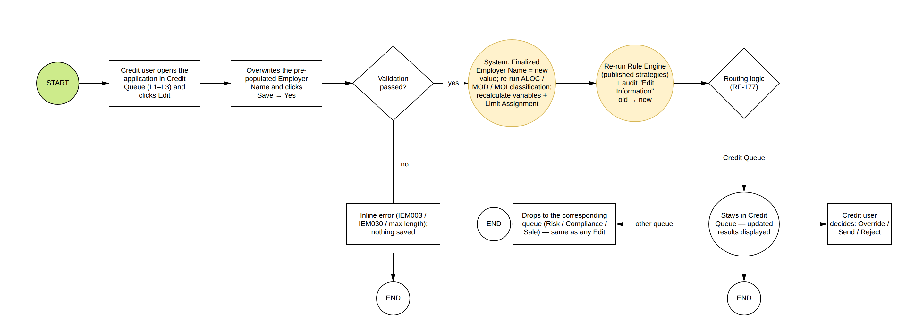

## Acceptance Criteria

### AC1: Employer Name section in the Edit Application pop-up

**Navigation:** Queue → Credit Queue (L1 / L2 / L3) → click a row → Application Details (SC2) → **Edit** → Edit Application pop-up → new section **"Employer Name"** placed after **"Length of Service"** — the last section of the pop-up as built (Application Details / Finalized Income → Other Income And Expenses → Liability Info → Length of Service, RF-1492 / RF-2682) — and before the Clear All / Cancel / Save actions (SC3).

**SC2 – Credit Queue › Application Details, Edit entry point** (`SC2_Credit_Queue_Application_Details_Edit_Button.png`)

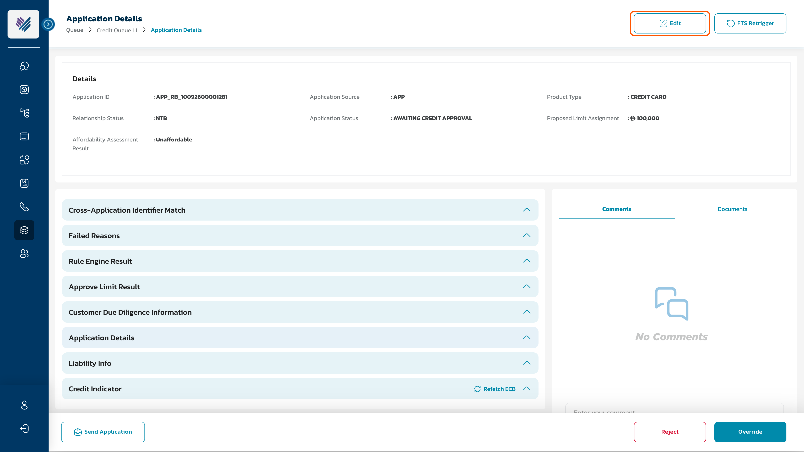

**SC3 – Edit Application pop-up, Employer Name section** (`SC3_Edit_Application_Popup_Employer_Name.png`)

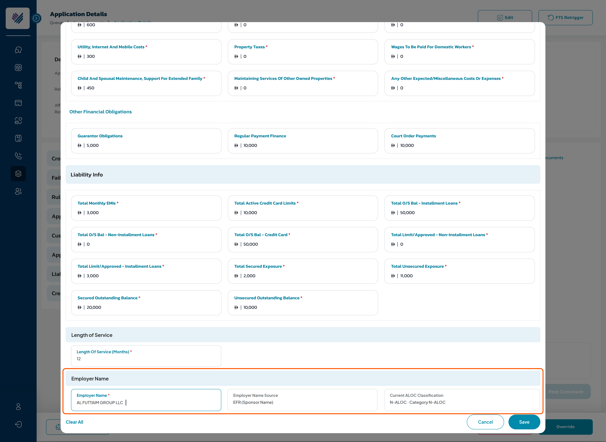

| Name | Component Type | Mandatory | Editable | Description |
| --- | --- | --- | --- | --- |
| Employer Name (section header) | Section bar | N/A | N/A | Text "Employer Name". Full-width light-blue section bar styled consistently with the existing section bars ("Application Details", "Other Income And Expenses", "Liability Info", "Length of Service"). Displayed only when the user's role has "Edit Employer Name" = TRUE (AC4). |
| Employer Name | Input field card | Yes | Yes | Field card in the standard Edit pop-up style (bordered card, field label with red asterisk, value below). **Pre-populated with the current [Finalized Employer Name]** of the application — the value derived by the current logic (RF-174 AC2 Step 2: EFR [Sponsor Name] for Mainland / Freezone, the Customer Journey [Employer Name] for GCC / Golden / Family visa) and stored in [CompanyName]. The user overwrites the text in place. **Validation consistent with the Customer Journey Employer Name field (RF-8 / RF-18 AC1):** alphabetic characters only → **IEM030** (*The employer name can contain only alphabetic character. Please try again!*); max length **200** characters (the Empaneled Company [Employer Name] length, RF-869 AC1) → **IEM076**; blank → **IEM003**. English only in the Super Portal (Arabic handling of RF-2087 applies to the Customer Journey). Value stored trimmed, upper-cased for matching as today. If the value is unchanged on Save (case-insensitive), the Employer Name branch of AC2.3 is skipped — no re-classification is triggered for an unchanged name. |
| Employer Name Source | Field card (read-only) | N/A | No | Read-only card beside the Employer Name field. Origin of the pre-populated value: **EFR (Sponsor Name)** \| **Customer Journey** \| **Credit User** (after a previous edit). |
| Current ALOC Classification | Field card (read-only) | N/A | No | Read-only card beside the Employer Name field. Current [ALOC] result and [Employer Category] (RF-424 AC3), e.g. "N-ALOC · Category N-ALOC" or "ALOC · Category A". |
| Clear All | Link button | N/A | N/A | Bottom-left of the pop-up (existing control). Reloads all sections with the stored values (removes the changes) — behaviour unchanged (RF-1492). |
| Cancel | Button | N/A | N/A | Cancels the editing — AC3. |
| Save | Button | N/A | N/A | Bottom-right (existing control). **Disabled until at least one value in the pop-up changes** (existing behaviour — an unchanged Employer Name alone keeps Save disabled). Saves the change — AC2. |

Applicable status for the edit (unchanged from the existing Edit sections):

| Product Type | Queue / Status where the Employer Name can be edited |
| --- | --- |
| CC | Credit Queue L1 / L2 / L3 — Application Status `Awaiting Credit Approval` |
| PL | Credit Queue L1 / L2 / L3 — Application Status `Awaiting Credit Approval` |

The edit shall be restricted in the below scenarios (existing Edit rules apply):

| Scenario | Condition |
| --- | --- |
| Application waiting for FTS income | Header message "The application is pending in FTS income" — Edit disabled per RF-265 AC3 |
| Application locked by another request | Recalculation / Rule Engine run in progress → "The Application is in another request processing." (RF-2682 AC2 step 8) |
| User without the permission | "Edit Employer Name" = FALSE → section hidden; all Edit permissions FALSE → Edit button hidden (RF-1501 AC2) |
| Application not in Credit Queue | Application Enquiry, Risk / Compliance / Sale queues — view only |

### AC2: Save updated information

**AC2.1: Validation** — when the user clicks Save the system checks, in order:

* [Employer Name] blank → **IEM003** (inline).
* [Employer Name] contains non-alphabetic characters → **IEM030**; exceeds 200 characters → **IEM076**.
* [Employer Name] equals the current [Finalized Employer Name] → Save stays disabled if nothing else changed; if other sections changed, the Employer Name branch of AC2.3 is skipped (no message) and the other sections are saved as today.
* Other edited sections (Limit Assignment, Finalized Income, Liability Info, Length of Service, Other Income and Expenses) keep their own validations (RF-1492 AC1, RF-2682 AC2 step 1).

**AC2.2: Confirmation** (SC4, `SC4_Edit_Employer_Name_Confirmation_Popup.png`) — one confirmation for the whole pop-up, as today; the note is extended with the ALOC re-run when the Employer Name changed

* After validation passes the system shows the confirmation message (CM002 shape, as RF-1492 AC2): **"Are you sure you want to update this \<Application ID\>?"** — sub-text: *Employer Name of \<Application ID\> will change from "\<current\>" to "\<new\>"* — note: *Note that the system will re-run the ALOC classification, auto-recalculate the related fields and then re-run the Rule Engine. Please choose carefully!*
* **No** → the confirmation closes, back to the Edit pop-up. **Yes** → AC2.3.

**AC2.3: System actions on confirmation** — executed in this order; every step is a system action with [Action by] = \<System\> except the user's own edit step:

| # | Action | Rule / Reference |
| --- | --- | --- |
| 1 | **Override the finalized Employer Name.** Keep the previous value as **[Original Employer Name]** together with its **[Original ALOC Classification]** / [Original Employer Category] (set once, at the first edit — the system-derived value of RF-174 / RF-424). Then [Finalized Employer Name] (= Application [CompanyName], RF-174 AC2) = \<inputted Employer Name\>; [Employer Name Source] = "Credit User"; [Employer Name Updated By] = \<user email id\>; [Employer Name Updated On] = \<current date time\>. The source data are **not** modified: EFR [Sponsor Name] and the Customer Journey [Employer Name] stay as retrieved / inputted. | Single source of truth: every consumer of the Employer Name reads [Finalized Employer Name] (AC5). |
| 2 | **Re-run the employer classification** with the new [Finalized Employer Name]: push it to Rosette and compare with the Empaneled Company list — score ≥ 0.9 **and** Category ≠ NON-ALOC → [ALOC] = 1, save [Employer Category], [Sector], [Industry], [Employer Status], [Employer Land Line & Contact Details], [HR Contact Person (Name)], [HR Contact Number/Email] from the matched row; otherwise [ALOC] = 0, [Employer Category] = N-ALOC and the RF-869 AC2 fields are hidden. Re-evaluate the **MOD / MOI / Pensioner** flags against the MOD/MOI master table with the same matching (RF-424 AC2.1); the AECB pension check (RF-424 AC2.2) is unchanged. The result is stored as the **updated** classification; the original classification stays available for display (AC6). | RF-424 AC2 + AC3, RF-869 AC3 |
| 3 | **Recalculate the related fields** — Calculated Variables (RF-425) and the Approved Limit Amount / Limit Assignment (IB-398, RF-134 CC, RF-361 PL), because the classification (ALOC / MOD / MOI / Pensioner) drives the maximum DBR and the income-multiplier group. ECB extracted data are recalculated as part of the standard edit recalculation (RF-2682 AC2 step 2); DBR inputs are unchanged. | RF-2682 AC2 step 2 |
| 4 | **Re-run the Rule Engine** — Segmentation (RF-132), Filtration (RF-138), Deviation (RF-159) — against the **currently published** strategy / score-check versions; the Industry, Sector (RF-1896) and classification-based attributes evaluate on the new values. The Rule Engine re-run counter applies as for every edit action (RF-2682 AC2 step 3): the flag counting re-runs is shared by Edit Info, Re-fetch ECB and Retrigger FTS; if the application fails the Rule Engine more than 2 times → Application Status = "Rejected". | RF-132 / RF-138 / RF-159, RF-2682 AC2 step 3 |
| 5 | **Routing** — after the re-run the system follows the routing logic (RF-177) and drops the application to the corresponding queue: it stays in the Credit Queue at its current level, or drops to the queue the routing logic determines — same behaviour as any existing edit. Application Status remains `Awaiting Credit Approval` unless the routing changes it. **No new Application Status** → no mobile-app impact. | RF-177 |
| 6 | **Audit trail** — store basic audit trail (**CR 003**) and the [Application History] object: [Application ID] = \<current Application ID\>; [Step] = "Edit Information"; [State] = \<current status of application\> (RF Customer Journey Detail Description #41); [Start Time] / [End Time] = yyyy-MM-dd HH:mm:ss; [Step Status] = "Successful"; **[Step Detail] = 'Employer Name updated from "\<old Finalized Employer Name\>" to "\<new Finalized Employer Name\>" by %Username%. Classification: \<original ALOC / Category\> → \<updated ALOC / Category\>'**; [Action by] = \<user email id\>. This makes the old / new values explicit in the audit trail (ticket scope) and resolves the RF-2827 expectation of a dynamic step detail for this field. The Rule Engine and Limit Assignment re-runs log their own existing steps with [Action by] = \<System\>. | CR 003, RF-2682 AC2 step 5, RF-2827 |
| 7 | **Loading and concurrency** — same as RF-2682 AC2 step 8: the loading screen displays up to 15 seconds; all other actions in Credit Queue are blocked while the recalculation and Rule Engine run; another action during the run shows "The Application is in another request processing."; after success the actions are available again. | RF-2682 AC2 step 8 |
| 8 | **Refresh** — toaster **IM004** *Application "\<Application ID\>" is updated successfully!*; the Application Details, Rule Engine Result and Approve Limit Result sections reload with the recalculated values (SC5, AC6). | IM004 |

* Employer Name edits are combined with the other sections in one Save: if the user changed several sections, the recalculation and the Rule Engine run once, after all values are stored (as RF-1492 AC2 "Else" branch).
* **Repeat edits:** no cap on the number of Employer Name edits per application; each edit is audited (step 6), the latest saved value is the finalized one and [Original Employer Name] is never overwritten after the first edit.

### AC3: Cancel Editing Application

User clicks the Cancel button → confirmation "Are you sure you want to cancel the updating application \<Object\>? The changing information will not be saved." — **No** → back to the Edit pop-up; **Yes** → the pop-up closes, nothing changes (RF-1492 AC3 / RF-2682 AC3).

### AC4: Permission — Role Management (SC1)

**SC1 – Role Management › Manually Queue › Credit Queue L1** (`SC1_Role_Permission_Credit_Queue_Edit_Employer_Name.png`)

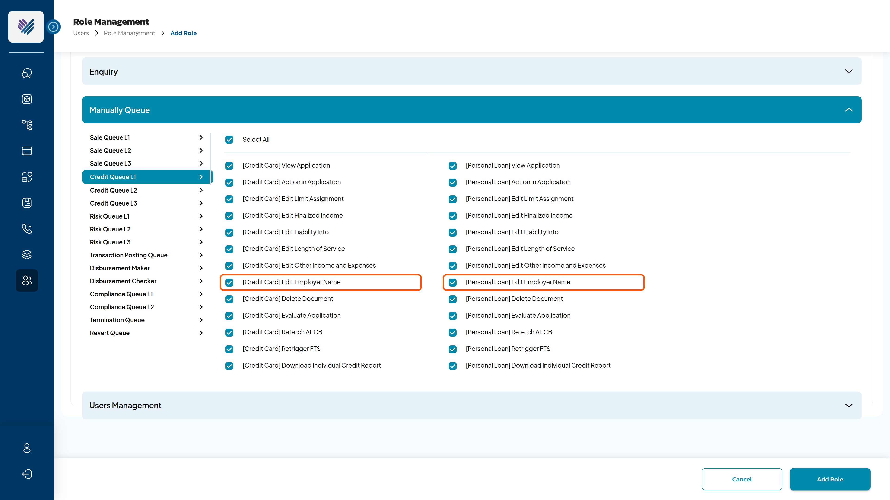

* A new permission **"Edit Employer Name"** is added to the Editor group of **Credit Queue L1, Credit Queue L2 and Credit Queue L3** under Manually Queue (Users › Role Management › Add Role), next to the existing Edit Limit Assignment / Edit Finalized Income / Edit Liability Info / Edit Length of Service / Edit Other Income and Expenses permissions (RF-1501 AC1, RF-2682 IA1). Product-tab treatment ([Credit Card] / [Personal Loan]) is identical to the existing "Edit Length of Service" permission of the live build.

| Menu (Group Permission) | Sub-Menu (Permission) | Action (Permission Detail) | Group | Display Permission Name |
| --- | --- | --- | --- | --- |
| Manual Queue | Credit Queue L1 | Edit Employer Name | Editor | Edit Employer Name |
| Manual Queue | Credit Queue L2 | Edit Employer Name | Editor | Edit Employer Name |
| Manual Queue | Credit Queue L3 | Edit Employer Name | Editor | Edit Employer Name |

* Applying rules (RF-1501 AC2): "Edit Employer Name" = TRUE → the user sees and can update the Employer Name section of the Edit pop-up; = FALSE → the section is hidden; a role with **all** Edit permissions = FALSE (including the new one) → the Edit button is hidden.
* The permission is a distinct right — never bundled with Evaluate Application or Send Application (RF-2781 / RF-2785 precedent). The **[RF] Permission Matrix** page is updated with the three new rows.

### AC5: Finalized Employer Name — override of every consumer

After AC2.3 step 1 the new value is the only Employer Name of the application. Wherever the Employer Name is read, displayed, calculated or generated, the system reads **[Finalized Employer Name]**:

| Consumer | Behaviour after the edit | Reference | Status |
| --- | --- | --- | --- |
| Application Details › Employment Information — Credit Queue (all levels), Risk Queue, Sale Queue, Compliance Queue, Application Enquiry | Displays the updated Employer Name as the working value, plus the **Employer Name Update** block (original name + original classification, updated name + updated classification, updated by / on — AC6); Company Category / Sector / Industry / Employer Status / contact fields refreshed from the re-classification (hidden when N-ALOC). | RF-869 AC2 + AC3 "Apply for" list, AC6 | Confirmed |
| ALOC / N-ALOC, Employer Category, MOD / MOI / Pensioner flags | Re-classified from the new value. | RF-424, RF-869 | Confirmed |
| Rule Engine attributes (Industry, Sector, classification-based) and Limit Assignment (maximum DBR, income-multiplier group) | Re-run / recalculated (AC2.3 steps 3–4); results shown in Rule Engine Result and Approve Limit Result. | RF-1896, RF-132/138/159, RF-134/361 | Confirmed |
| Length of Service | **Not** re-run. The Employer Name edit does not re-trigger the AECB / EFR / MOHRE comparison of RF-1241; the Credit user corrects LOS in its own section when needed. | RF-1241, RF-1492 | Confirmed (PO decision) |
| CAM report | Generated at the credit decision from the application data → carries the new Employer Name and classification, as after any edit. | RF-2195, RF-2675, RF-2087 AC6, RF-2682 IA3 | Confirmed |
| Application Form / Customer Document Stack / Affordability Assessment Form | Where the form prints an Employer Name it reads [Finalized Employer Name] at generation time, as after any edit. | RF-1962, RF-2002, RF-2490, RF-2682 IA2 | ⚠️ TBC — Dev to confirm which templates print the Employer Name |
| Core banking (T24 CIF creation) and EastNets AML | If the Employer Name is a request parameter, the API reads [Finalized Employer Name] at the time it is triggered (post-decision). | RF-2749, RF-2194 | ⚠️ TBC — Dev to confirm whether Employer Name is sent |
| Reporting / MIS (Report Enquiry, CAM, WIP, Exception) | Read the finalized value; the Application History carries the old → new change. | — | Confirmed |
| Customer Journey / customer communication | No change; the customer is not notified of the correction. | — | Confirmed |

### AC6: Display in the Credit Queue and Application Enquiry

**SC5 – Application Details after the update** (`SC5_Application_Details_Employer_Name_Updated.png`)

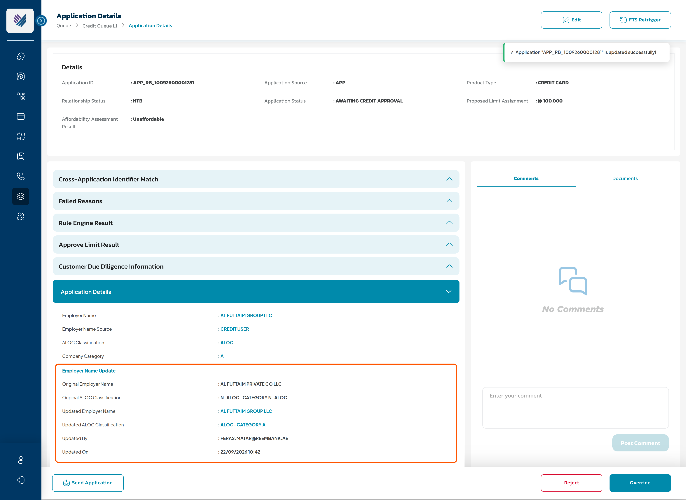

The working value stays in the existing field; the change is made traceable by a new **Employer Name Update** sub-block inside the expanded Application Details section (teal sub-header + `Label : VALUE` rows, the standard expanded-section display). It shows the original and the updated value with their classification:

| Field (Application Details › Employment Information) | Value after the edit | Source |
| --- | --- | --- |
| Employer Name | \<updated Finalized Employer Name\> — the value the system uses | AC2.3 step 1 |
| Employer Name Source *(new label)* | EFR (Sponsor Name) \| Customer Journey \| **Credit User** | [Employer Name Source] |
| **Employer Name Update** *(new sub-block — shown only after an edit; hidden otherwise per RF-265 AC2)* | | |
| Original Employer Name | \<system-derived value before the first edit\> | [Original Employer Name] |
| Original ALOC Classification | ALOC \| N-ALOC · Category \<X\> | [Original ALOC Classification] |
| Updated Employer Name | \<current Finalized Employer Name\> | [Finalized Employer Name] |
| Updated ALOC Classification | ALOC \| N-ALOC · Category \<X\> | AC2.3 step 2 |
| Updated By / Updated On | \<user email id\> / DD/MM/YYYY hh:mm | AC2.3 step 1 |
| ALOC Classification, Company Category, Sector, Industry, Employer Status, Employer Land Line & Contact Details, HR Contact Person (Name), HR Contact Number/Email | Refreshed from the re-classification; hidden when [ALOC] = 0 | RF-869 AC2 |
| Rule Engine Result, Approve Limit Result sections | Recalculated results of AC2.3 steps 3–4 | RF-265 |

* Display rule unchanged: fields with an empty value are hidden (RF-265 AC2) — an application that was never edited shows no Employer Name Update block.
* After repeated edits the block keeps the **first** original value and the **latest** updated value; the intermediate values are in the Application History (SC6).

**SC6 – Application Enquiry › Application History** (`SC6_Application_Enquiry_History_Edit_Employer_Name.png`)

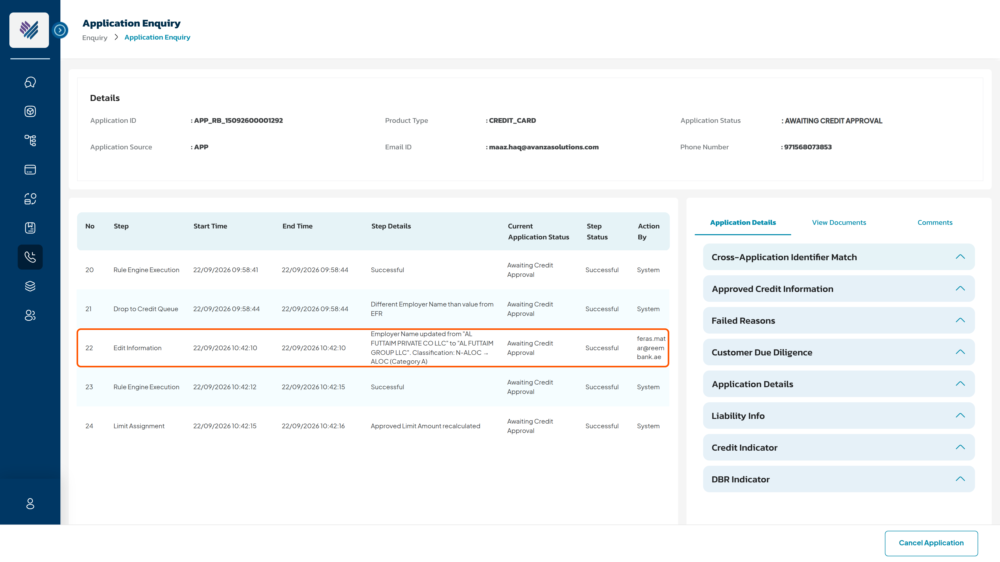

* The Application History list in Application Enquiry shows the "Edit Information" step of AC2.3 step 6 with the old and new Employer Name in Step Details and the Credit user in Action By, followed by the system steps of the re-run.

## Impact Analysis

| Area | Impact | Screen |
| --- | --- | --- |
| Role Management / Permission Matrix | **New permission "Edit Employer Name"** on Credit Queue L1, L2, L3 (Editor group; per product tab as the existing Edit permissions). Permission Matrix page updated. Distinct right — never bundled. |  *Role Management › Credit Queue L1 (SC1)* |
| Edit Application pop-up (Credit Queue) | New **Employer Name** section: editable field pre-populated with the finalized Employer Name, source and current classification as read-only labels; Customer Journey validation (IEM030 / IEM076 / IEM003). Confirmation pop-up note extended with the ALOC re-run. | 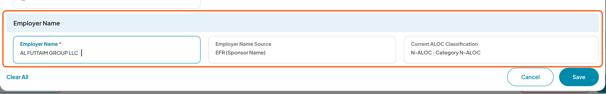 *Edit Application › Employer Name (SC3)* |
| Employer classification (ALOC / MOD / MOI / Pensioner) | The RF-424 / RF-869 classification step becomes **re-runnable on demand** for one application with a user-provided name; it must overwrite the previous classification results and the RF-869 AC2 fields atomically. | 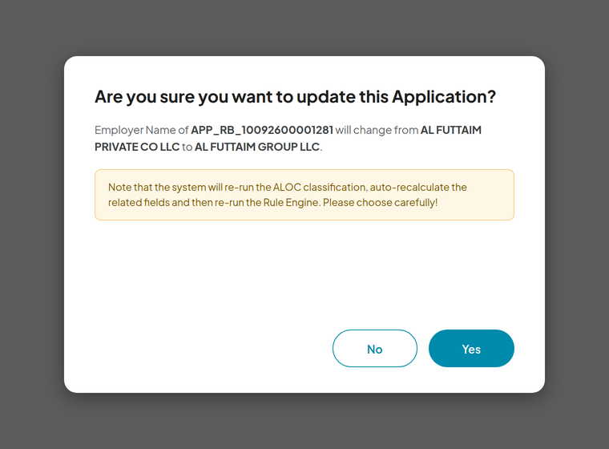 *Confirmation before the re-run (SC4)* |
| Rule Engine & Limit Assignment | Re-run on the new classification against the currently published versions; re-run counter shared with Edit Info / Re-fetch ECB / Retrigger FTS (RF-2682). Recalculation of Calculated Variables and Approved Limit Amount. | 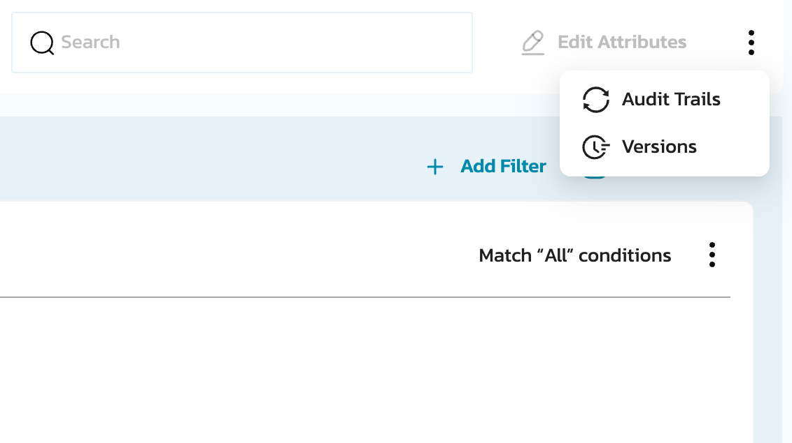 *Strategies › Versions / Audit Trails* |
| Audit trail | "Edit Information" step with a **dynamic Step Detail** (original → updated Employer Name and classification change) — closes the RF-2827 gap for this field (CR 003). |  *Application History (SC6)* |
| Application Details display | New **Employer Name Source** label and the **Employer Name Update** block (Original / Updated name and ALOC classification, Updated By / On) on the five Application Details screens of RF-869 AC3 (Credit / Risk / Sale / Compliance queues, Application Enquiry); classification fields refreshed. | 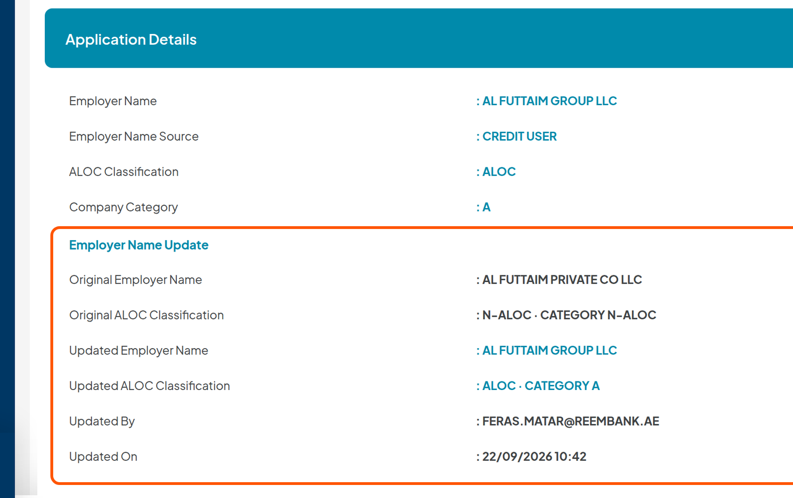 *Application Details › Employment Information (SC5)* |
| Queue model / drop points | No new drop point. Routing after the re-run follows RF-177; cases parked by drop point 12 (*different Employer Name than EFR*) can now be resolved inside the queue instead of rejected — volume effect on Credit Queue is neutral to positive. | 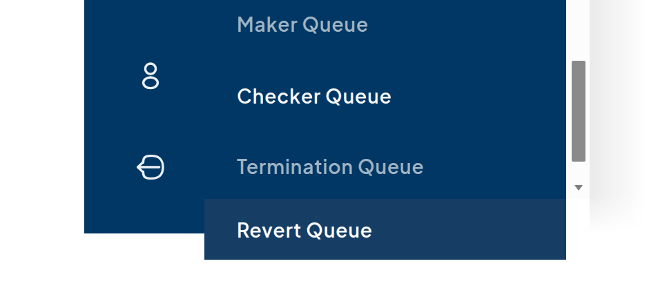 *Queue menu* |
| Status model / mobile app | No new Application Status; status stays `Awaiting Credit Approval` unless the routing changes it → **no mobile-app change**. | 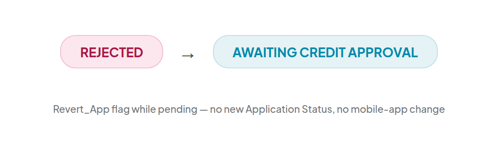 *Status unchanged by the edit* |
| Communication Setup | **No new template.** Existing drop-to-queue notifications apply if the routing moves the application (RF-3067 fix). The customer is not notified. | 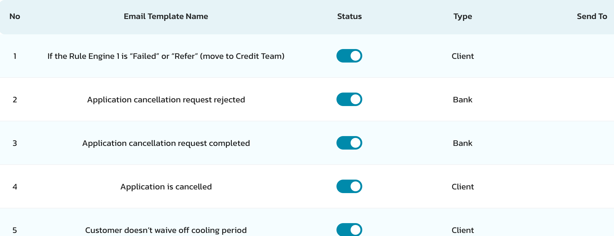 *Email Templates — unchanged* |
| Documents / Reporting | CAM report, Application Form, Customer Document Stack, Affordability Assessment Form generated after the edit read the finalized value (TBC which templates print it). Report Enquiry reads the finalized value. | — |
| Services | backoffice-service (Edit API + permission), application-service (finalized name, source, classification fields), rule-engine / limit-assignment services (re-run), Rosette matching (classification), audit-trail-service, work-flow-service (re-entry of the RE step on an in-flight process instance — same mechanism as RF-1492 subtask RF-1553). | 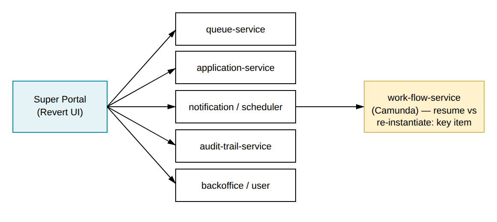 *Services* |

## Dependencies & related in-flight tickets (RF board scan 22/09)

| Ticket | Status | Relevance to this story |
| --- | --- | --- |
| RF-1501 | SIT TESTING COMPLETED | Permission model for the Edit sections — AC4 adds one permission per Credit Queue level following its AC1/AC2 rules. |
| RF-1492 | SIT TESTING COMPLETED | Edit Length of Service — reference for the Edit pop-up, Save / Cancel behaviour and the workflow re-entry subtask (RF-1553). |
| RF-2682 | READY IN UAT | Edit Other Income and Expenses — latest section pattern (placement, IA1 permission, IA2/IA3 document regeneration, RE re-run counter). The Employer Name section is placed after it. |
| RF-424 / RF-869 | SIT TESTING COMPLETED | ALOC / MOD / MOI / Pensioner classification and the Empaneled Company fields — the logic re-run in AC2.3 step 2. |
| RF-1896 | READY IN UAT | Industry / Sector attributes in Segmentation and Filtration sourced from the ALOC logic — evaluated on the new classification. |
| RF-1843 / RF-1834 | READY IN UAT / Open | New acceptable values for Employer Category in Empaneled Company — the re-classification returns whatever Category values the master carries. |
| RF-174 / RF-1241 | SIT TESTING COMPLETED | Finalized Employer Name derivation and Length of Service logic — source of the current value; LOS deliberately not re-run (AC5). |
| RF-2827 | READY IN UAT | Static Step Detail on edit in Compliance Queue — AC2.3 step 6 defines the dynamic Step Detail for this field. |
| RF-2806 / RF-2334 / RF-3214 / RF-3195 | READY IN UAT / READY IN SIT / SIT TESTING COMPLETED / Open | Employer Name dropdown and search defects in the Customer Journey (invalid data, no search results, Arabic suggestions) — root causes of wrong employer names that this edit remedies. |
| RF-2087 / RF-2086 | SIT TESTING COMPLETED / READY IN UAT | Arabic Employer Name in the Customer Journey — Super Portal edit is English only; Arabic-typed names are one of the E2 cases. |
| RF-3305 | DEV IN PROGRESS | Application Revert — reverted cases re-enter Credit Queue L1 and use this edit to correct the employer before re-decision (E4). |
| RF-3269 | SIT TESTING COMPLETED | Income Related Info section in the Credit Queue view — same Application Details screen extended by AC6. |
| RF-3138 | READY IN UAT | Drop points / Failed Reason updates 2 — coordinate: no new drop point here, routing after the re-run must align with the updated matrix. |
| RF-2957 | Open | Mortgage Loan Credit Queue edit — out of scope here; the Employer Name section should be mirrored there when ML is specified. |
| RF-2359 | READY FOR APPROVE | Employment Type on Application Enquiry details — adjacent labels in the same Employment Information block as AC6. |

## Out of scope

* CASA (no credit decisioning), Mortgage Loan (RF-2957), Auto Loan.
* Editing the Employer Name from Application Enquiry or from Risk / Compliance / Sale queues (view only there).
* Editing Employment Category / Employment Type; re-running Length of Service (own edit section, RF-1492); re-fetching EFR, AECB or MOHRE data.
* BVE integration in the Super Portal (the Customer Journey dropdown source); Arabic input in the Super Portal; changes to the Empaneled Company upload format or validation (RF-869).
* Maker–checker approval of the Employer Name edit and a mandatory change reason (none of the existing Edit sections has one — the audit trail records the change); bulk edit; customer notification of the correction; a cap on the number of edits.
