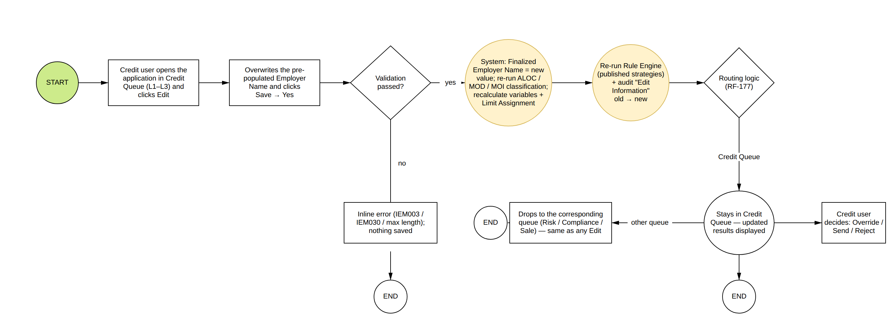
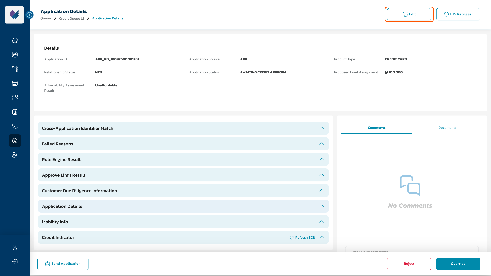
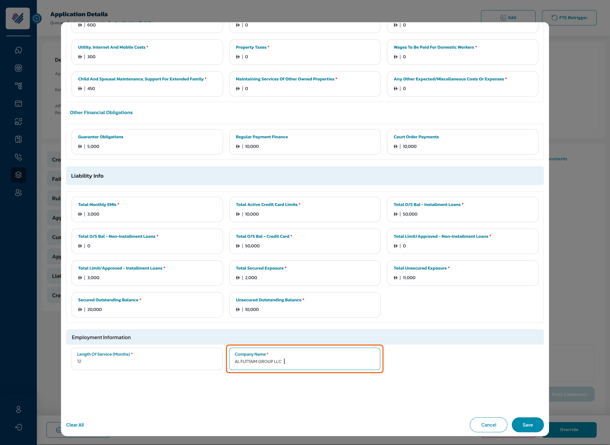
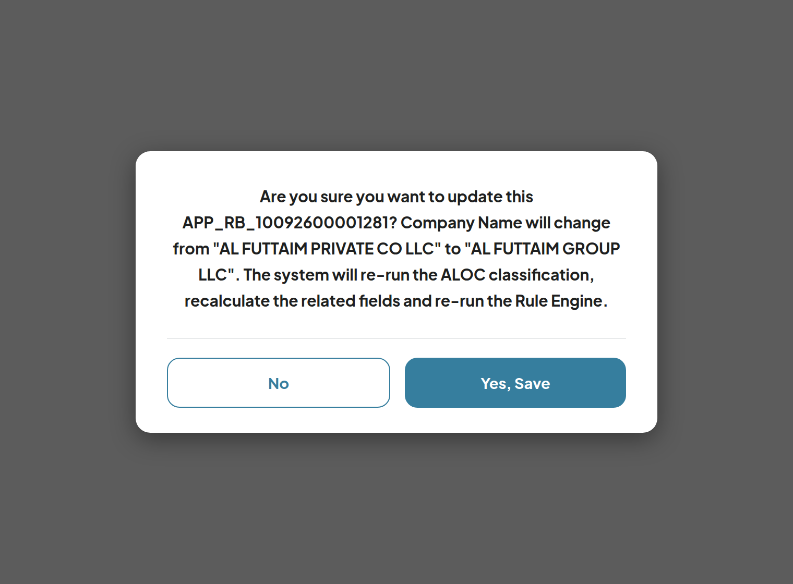
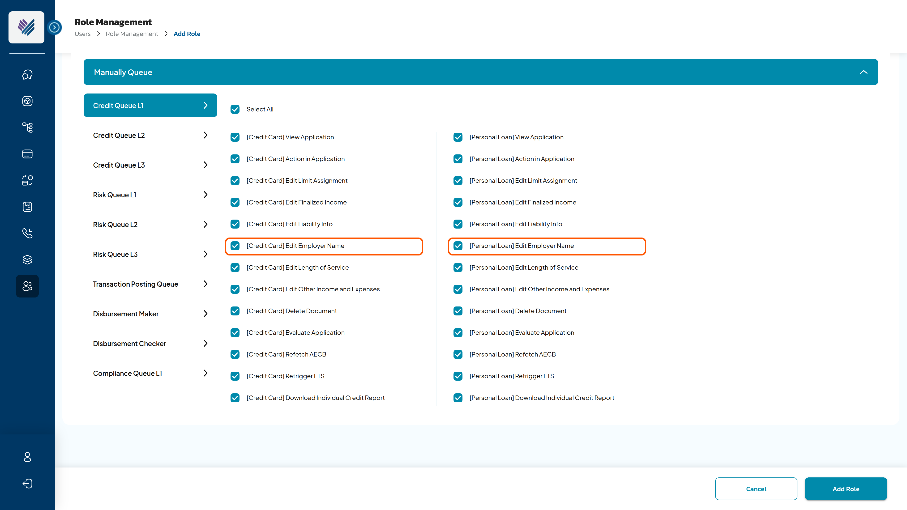
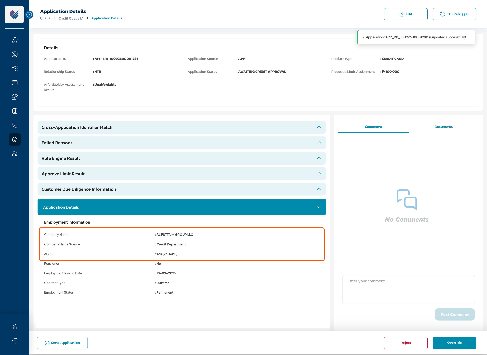
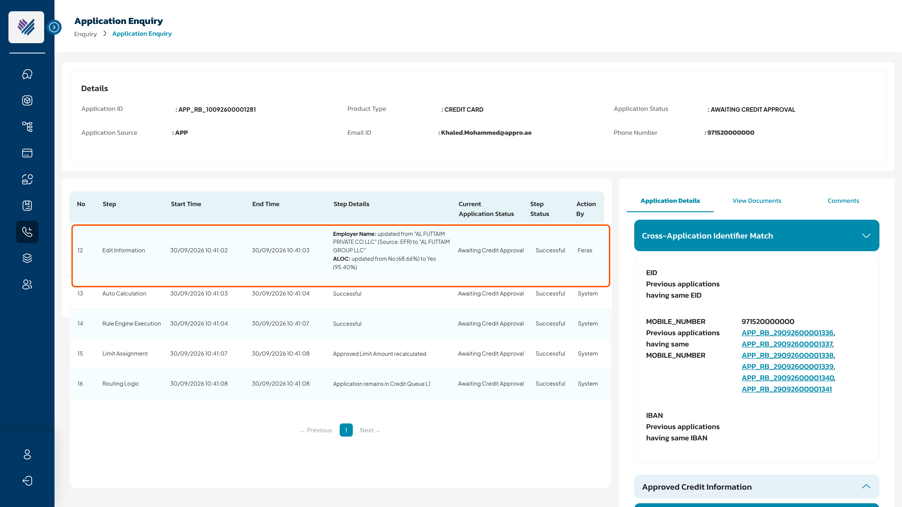

# [Enhancement] Credit Queue – Employer Name edit with ALOC & Rule Engine re-run

**Source:** RF Appro September 2026 Combined List – Item 3 (Change Request, Credit Department). Cost approval required before implementation.

---

## Context of Business

* Today the Employer Name is system-derived and locked: EFR [Sponsor Name] (Mainland / Freezone) or the Customer Journey input (GCC / Golden / Family visa) — RF-174. No bank user can correct it, although it drives the ALOC classification, MOD / MOI / Pensioner flags, Rule Engine attributes and the maximum DBR.
* Wrong employer names (EFR name ≠ Empaneled list name, customer typos, Arabic input) drop applications to Credit Queue L1 (drop point 12) with no way to fix them — the Credit user can only decide on N-ALOC terms or reject.
* This story adds Employer Name as a new editable section of the existing Edit Application pop-up in Credit Queue. On save: override the finalized Employer Name → re-run ALOC classification → recalculate related fields → re-run Rule Engine → display the results.

## User Story Details

* **As a** Credit Queue user with the "Edit Employer Name" permission, **I want** to correct the Employer Name of an application in Credit Queue (L1–L3), **so that** classification, eligibility and limit assignment reflect the true employer before I decide the case.
* **Scope:** Credit Card and Personal Loan. Entry point: the existing **Edit** button on Credit Queue › Application Details.
* **Screens:** SC1 permission · SC2 Edit entry point · SC3 Edit pop-up · SC4 confirmation · SC5 display after update · SC6 application history · Flow diagram — attached with the same file names.

## Acceptance Criteria

### AC1: Employment Information section in the Edit Application pop-up

**Navigation:** Queue → Credit Queue (L1 / L2 / L3) → select application → **Edit** → Edit Application pop-up → new section **"Employment Information"** after "Length of Service" (SC3).

| Name | Component Type | Mandatory | Editable | Description |
| --- | --- | --- | --- | --- |
| Employment Information | Section bar | N/A | N/A | Same style as the existing section bars. Shown only when the user's role has "Edit Employer Name" = TRUE (AC4). |
| Company Name | Input field card | Yes | Yes | The only field of the section. Pre-populated with the current finalized Employer Name ([CompanyName], RF-174). Validation as the Customer Journey field: alphabetic only → **IEM030**; max 200 characters → **IEM076**; blank → **IEM003**. Unchanged value on Save → the Employer Name re-run is skipped. |
| Clear All / Cancel / Save | Existing controls | N/A | N/A | Unchanged behaviour (RF-1492): Clear All reloads stored values; Cancel → AC3; Save disabled until a value changes → AC2. |

Applicable status: CC and PL — Credit Queue L1 / L2 / L3, Application Status `Awaiting Credit Approval`. Existing Edit restrictions apply unchanged (FTS pending, application locked by another request, no permission, other queues view-only).

### AC2: Save updated information

**AC2.1 Validation** — IEM003 / IEM030 / IEM076 as AC1; other edited sections keep their own validations.

**AC2.2 Confirmation** (SC4) — the existing Edit confirmation component (centered message, No / Yes, Save buttons), one confirmation for the whole pop-up. Message (professionalised — replaces the live "…Please choose carefully!" wording): *"Are you sure you want to update this \<Application ID\>? Company Name will change from "\<current\>" to "\<new\>". The system will re-run the ALOC classification, recalculate the related fields and re-run the Rule Engine."* **No** → back to the pop-up. **Yes, Save** → AC2.3.

**AC2.3 System actions on confirmation**, in order:

| # | Action | Reference |
| --- | --- | --- |
| 1 | Override [Finalized Employer Name] with the input; keep the first system-derived value as [Original Employer Name] + [Original ALOC]. Set [Employer Name Source] = "Credit User", Updated By / Updated On. EFR and Customer Journey source data are not modified. | RF-174 |
| 2 | Re-run the employer classification: Rosette match vs Empaneled Company list (score ≥ 0.9, Category ≠ NON-ALOC → ALOC + company fields; else N-ALOC). Re-evaluate MOD / MOI / Pensioner flags. | RF-424, RF-869 |
| 3 | Recalculate Calculated Variables and Limit Assignment (classification drives max DBR and multiplier group). | RF-2682 |
| 4 | Re-run the Rule Engine (Segmentation / Filtration / Deviation) on the published versions. Shared re-run counter applies; > 2 failures → Rejected. | RF-2682 |
| 5 | Routing per current logic; status stays `Awaiting Credit Approval` unless routing changes it. No new status. | RF-177 |
| 6 | Audit trail: [Step] = "Edit Information"; [Step Detail] = *Employer Name updated from "\<old\>" to "\<new\>" by %Username%. Classification: \<original\> → \<updated\>*; [Action by] = user email. | CR 003 |
| 7 | Loading up to 15s; application locked during the run ("The Application is in another request processing."). | RF-2682 |
| 8 | Toaster **IM004**; Application Details, Rule Engine Result and Approve Limit Result reload (SC5). | IM004 |

* Several sections edited in one Save → recalculation and Rule Engine run once, after all values are stored.
* No cap on repeat edits; [Original Employer Name] is set once and never overwritten.

### AC3: Cancel Editing Application

Cancel → existing confirmation → **Yes** closes the pop-up, nothing changes (RF-1492 AC3).

### AC4: Permission — Role Management (SC1)

New permission **"Edit Employer Name"** — Editor group of Credit Queue L1 / L2 / L3, per product tab, same treatment as "Edit Length of Service". TRUE → section visible; FALSE → hidden; all Edit permissions FALSE → Edit button hidden (RF-1501). Permission Matrix updated.

### AC5: Finalized Employer Name — override of every consumer

Every consumer reads [Finalized Employer Name] after the edit:

| Consumer | Behaviour after the edit |
| --- | --- |
| Application Details (all queues + Application Enquiry) | Updated name, re-classified ALOC, Employer Name Update block — AC6. |
| CAM report + Affordability Assessment Form | Regenerated on the edit (RF-2682 pattern). |
| Application Form | Not regenerated — remains the OTP-time record of the customer's submission. |
| Customer Document Stack | Generated post-decision → carries the updated value automatically. |
| T24 CIF Creation | No impact — the mapping carries no Employer Name (RF-2530). |
| EastNets AML | No re-screening on the edit; the corrected name reaches EastNets via the post-decision CIF-update call (RF-2194 / RF-2530). |
| Length of Service | Not re-run — own edit section (RF-1492). |
| Customer communication | None — the customer is not notified. |

### AC6: Display in Credit Queue and Application Enquiry

The fields below sit in the expanded **Application Details** section › **Employment Information** sub-block (SC5). The same section is shown in Credit Queue L1–L3, Risk Queue, Sale Queue, Compliance Queue and **Application Enquiry** (view only) — the enquiry details display the updated values identically, and its Application History shows the Edit Information step (SC6). The Edit pop-up carries only the editable field; the full picture is view-only here:

| Field | Value after the edit |
| --- | --- |
| Company Name | Updated finalized Employer Name |
| Company Name Source *(new)* | EFR (Sponsor Name) \| Customer Journey \| Credit User |
| ALOC / Pensioner | Re-classified — live format `Yes` \| `No (<match %>)` |
| **Employer Name Update** *(new sub-block, shown only after an edit)* | Original Company Name · Original ALOC · Updated Company Name · Updated ALOC · Updated By · Updated On |

* Repeat edits: the block keeps the first original and the latest updated value; intermediates are in the Application History.
* Application Enquiry › Application History shows the "Edit Information" step with old → new in Step Details (SC6).

## Impact Analysis

| Area | Impact | Screen |
| --- | --- | --- |
| Role Management / Permission Matrix | New permission "Edit Employer Name" on Credit Queue L1–L3 | SC1 |
| Edit Application pop-up | New Employment Information section, single Company Name field | SC3 |
| Employer classification | ALOC / MOD / MOI / Pensioner re-runnable on demand per application | SC4 |
| Rule Engine & Limit Assignment | Re-run on the new classification; shared re-run counter | — |
| Audit trail | "Edit Information" step with dynamic old → new Step Detail | SC6 |
| Application Details display | Company Name Source row + Employer Name Update block on all queue / enquiry views | SC5 |
| Documents | CAM + Affordability Form regenerated; Application Form untouched | — |
| Status model / mobile app / Communication Setup | No change | — |

## Dependencies

| Ticket | Relevance |
| --- | --- |
| RF-1492 / RF-2682 | Edit pop-up pattern, Save/Cancel, re-run counter, document regeneration |
| RF-424 / RF-869 | ALOC classification logic re-run in AC2.3 |
| RF-1501 | Permission model (AC4) |
| RF-2194 / RF-2530 | EastNets / T24 basis of AC5 |
| RF-3305 | Reverted cases re-enter Credit Queue L1 and use this edit |
| RF-2957 | Mortgage Loan edit — mirror this section when ML is specified |

## Out of scope

* CASA, Mortgage Loan, Auto Loan.
* Editing from Application Enquiry or Risk / Compliance / Sale queues (view only).
* Editing Employment Category / Type; re-running Length of Service; re-fetching EFR / AECB / MOHRE.
* Arabic input and BVE integration in the Super Portal.
* Maker–checker, mandatory change reason, edit cap, customer notification.
* EastNets re-screening and Application Form regeneration on the edit.
