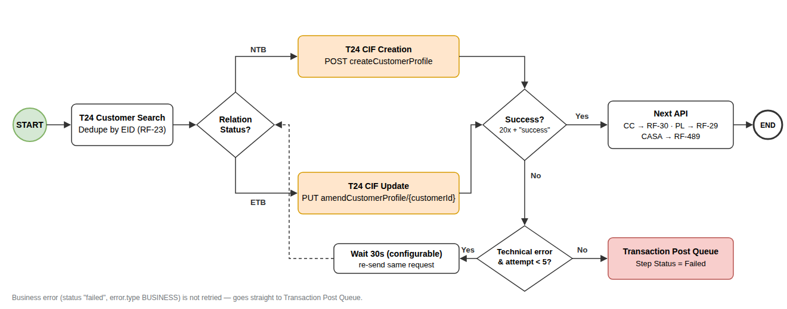

# RF-3204 — [Integration] T24 CIF Creation (NTB) / CIF Update (ETB)

**Format B: System / Backend** · Source: REEM Middleware API Specification v4.3 (05/10/2026) · CR – Marketing Consent T24 CIF Creation API Update (attached to ticket)

## Context of Business

T24 must hold the customer's latest verified profile and marketing consent after every onboarding. Today T24 CIF Creation runs for NTB only (RF-28 / RF-2530). ETB customers reuse the CIF from T24 Customer Search (RF-23), so T24 is never updated. Middleware Spec v4.3 adds the **Amend Customer Profile API** to close this gap.

**Scope:** CC, PL, CASA · NTB → T24 CIF Creation (existing API, plus consent) · ETB → T24 CIF Update (new API).

## User Story

As Reem Bank, I want every onboarded customer's CIF in T24 to be created (NTB) or updated (ETB) with the data verified in the application, including marketing consent, so that the core banking record is accurate and marketing contact respects the customer's choice.

## Trigger Point

| Relation Status (RF-23) | Action | API | Trigger |
|---|---|---|---|
| NTB | Create CIF | `POST createCustomerProfile` | Unchanged: RF-28 / RF-2530 trigger point per product |
| ETB | Update CIF | `PUT amendCustomerProfile/{customerId}` | Same trigger point as NTB |



## Acceptance Criteria

### AC1 — Route by Relation Status

- System reads [Relation Status] saved by T24 Customer Search (RF-23): NTB → AC2, ETB → AC3.
- Both calls use the Middleware Get Token API (Bearer token) and the same headers:

| Parameter | Type | Required | Values / Data Source |
|---|---|---|---|
| stan | String | M | Unique system audit trace number per request |
| Authorization | String | M | `Bearer <token>` from Get Token API |
| Content-Type | String | M | `application/json` |
| channel_id | String | M | Appro channel id (provided by Middleware) |

### AC2 — NTB: T24 CIF Creation (delta only)

- Request mapping is unchanged (RF-2530 / *[RF] Mapping Data – T24 – CIF Creation*), plus the 2 consent fields in AC4.
- **TBC by Avanza:** `createCustomerProfile` in Spec v4.3 has no consent field. Avanza to add `promotionRequired` / `PromotionRequired` with the same definition as the Amend API.
- Success → store [customer_id] → next API (unchanged).

### AC3 — ETB: T24 CIF Update

- **Method:** PUT · **Endpoint:** `{{host}}/api/T24/amendCustomerProfile/{customerId}` · **Auth:** Bearer token
- **customerId** (path) = [customer_id] from T24 Customer Search (RF-23).

**Request rules**

- **R1** Send only fields that have a value captured or verified in this application. Empty values are not sent (no "NA" / "NULL" placeholders as in Create).
- **R2** Never overwrite T24 with hard-coded or default values. The following fields are **not sent** on update: `mnemonic`, `nameOnId`, `employmentStatus`, `profession/businessCode`, `sector`, `language`, `fatcaDeclarationHeld`, `crsDeclarationHeld`, `customerAddressType`, `customerType`, `customerStatus`. The CASA income default "1" (RF-2749) is also not sent.
- **R3** `firstName` is mandatory in the Amend API and is always sent.
- **R4** Values longer than the T24 max length are truncated (RF-3088). Dates use the YYYYMMDD format.

**Request body**

| Parameter | Type | Required | Values / Data Source |
|---|---|---|---|
| title | Code | O | Same rule as Create: Male → MR · Female + Single → MISS · Female + other → MRS |
| firstName | 70, String | **M** | Same as Create |
| lastName | 70, String | O | Last word of EFR fullName |
| gbShortName | 50, String | O | Same as Create |
| gender | Code | O | EFR gender → `MALE` / `FEMAL` (Spec v4.3 values) |
| maritalStatus | Code | O | EFR → `SINGLE` / `MARRIED` / `DIVORCED` / `WIDOWED` / `OTHER` |
| dateOfBirth | 11, Date | O | EID birthDate |
| customerBirthCountry | 2 | O | EFR place_of_birth → ISO-2 |
| Nationality | 3 | O | EFR nationality → ISO-2 |
| residence · customerDomicile | 2 · 9 | O | EFR country → ISO-2 |
| customerEmirate | 35 | O | EFR emirates |
| buildingName · building/flatNo · Town/City · poBox/postalCode · country | per spec | O | Application address, the same sources as Create |
| mobilePhone | 35, Numeric | O | Application details |
| emailAddress.1 | 50 | O | Application details |
| legalId · issueDate · expiryDate · issuingAuthority · issueCountry | per spec | O | Passport, the same sources as Create (issue date per RF-2831) |
| documentType | Code | O | `PASSPORT`, sent only together with legalId |
| emiratesId · emiratesIdIssueDate · emiratesIdExpiryDate | 35 · 8 · 8 | O | Scan EID |
| netMonthlyIncome | 19 | O | Same as Create (RF-2749), excluding the default "1" |
| pep · amlRiskRating · amlRequestDate · blacklistedStatus · kycStatus | per spec | O | EastNets rules, the same as Create (RF-2530) |
| autoNextKycReviewDate · manualNextKycReviewDate | 8, Date | O | Risk-based, the same as Create (RF-2530) |
| dualNationality | 6 | O | `YES` if more than one nationality, else `NO` |
| promotionRequired · PromotionRequired | 3 · 10 | O | AC4 |

**TBC by Avanza (Spec v4.3 gaps)**

1. Success response sample for Amend. Only a failure sample is provided.
2. Partial update: confirm that omitted fields keep their T24 value and are not cleared.
3. Key names: `promotionRequired` and `PromotionRequired` differ only by case.
4. Endpoint is written as `amendCustomerProfile//{customerId}` (double slash).
5. Sample keys differ from the field table (`building_flatNo`, `emailaddress1`, `city`, `districtName` vs `building/flatNo`, `emailAddress.1`, `Town/City`, `district`). Confirm which key set is valid.
6. The response when no field changed (T24 "record not changed").

### AC4 — Marketing consent mapping

Source: Marketing & Cooling-off Consent screen (RF-14 CC / RF-4 PL / RF-321 CASA). The same mapping applies to Create (NTB) and Update (ETB).

| Customer choice | promotionRequired | PromotionRequired |
|---|---|---|
| Marketing Consent ticked (default) | `YES` | `BOTH` |
| Unticked, Email selected (± WhatsApp) | `YES` | `EMAIL` |
| Unticked, SMS selected (± WhatsApp) | `YES` | `SMS` |
| Unticked, Email + SMS (± WhatsApp) | `YES` | `BOTH` |
| Unticked, no channel selected | `NO` | `NONE` |
| Unticked, WhatsApp only | TBC | TBC: T24 has no WhatsApp value |

### AC5 — Response handling (NTB and ETB)

| Response | Condition | Handling |
|---|---|---|
| Success | HTTP 20x and `header.status` = "success" | NTB: store [customer_id]. ETB: keep [customer_id] from RF-23. Then trigger the next API: CC → RF-30, PL → RF-29, CASA → RF-489 |
| Business error | `header.status` = "failed" and `error.type` = "BUSINESS" | No retry → Transaction Post Queue |
| Technical error | Timeout, no response, or HTTP ≠ 20x | Retry after X sec (configurable, default 30), up to N times (configurable, default 5) → Transaction Post Queue |

## Audit Trail

```
* [Application ID] = <current Application ID>
* [Step] = {T24_Customer Onboarding} (NTB) / {T24_Customer Profile Update} (ETB)
* [State] = 'Awaiting Temenos Response'
* [Step Details] = stan <stan> · customerId <id> · Success, or <fieldName> · <code> · <message> per errorDetails
* [Start Time] = <request sent date time>
* [End Time] = <response or last timeout date time>
* [Attempt No.] = <n of N>
* [Response Detail] = full API response
* [Step Status] = Successful / Failed
* [Action by] = {System}
* Application Status = 'Awaiting Temenos Response' (unchanged)
```

## Dependencies

| Ticket | Relevance |
|---|---|
| RF-23 | Relation Status and the ETB customer_id |
| RF-28 / RF-2530 | Current CIF Creation trigger, mapping, retry and audit |
| RF-14 / RF-4 / RF-321 | Marketing consent capture |
| RF-3088 | Truncation to T24 max length |
| RF-2831 / RF-2749 | Passport issue date and net monthly income rules |
| Avanza (Middleware) | Spec v4.3 TBCs: consent on Create, Amend success sample, partial-update behaviour |

## Out of scope

- Fields that Create does not send today (e.g. `employersName`, `customerSalary`, `jobTitle`). The update keeps parity with the Create mapping.
- T24 Customer Search, Freeze & Block, Loan and Repayment Account APIs: no change.
- EastNets CIF update for ETB: no change (RF-2194).
