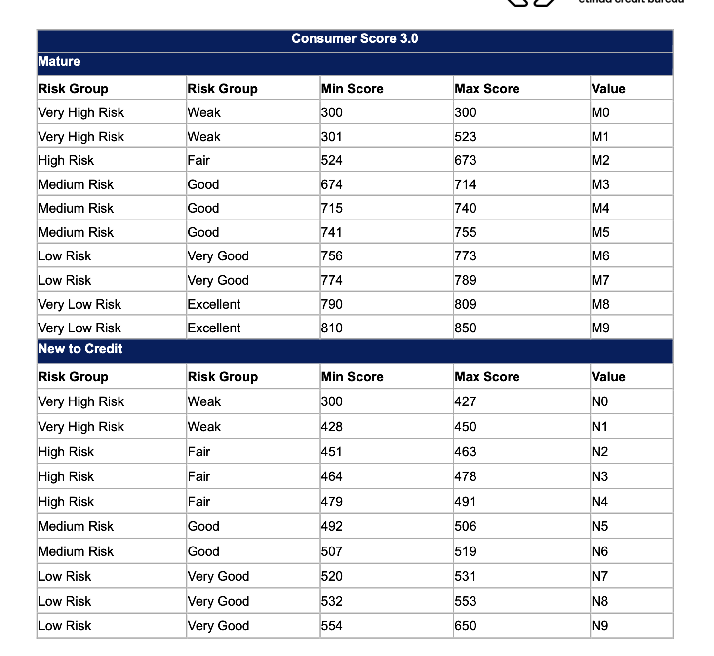
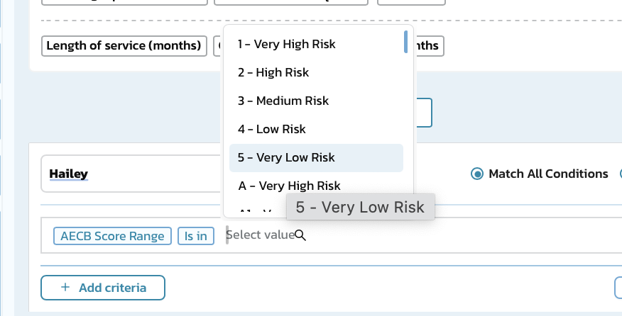
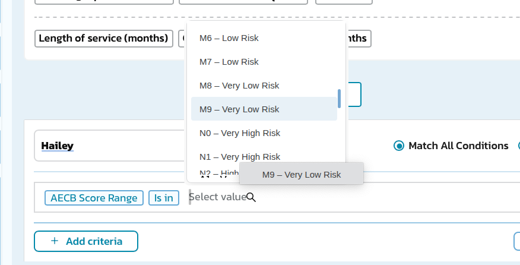
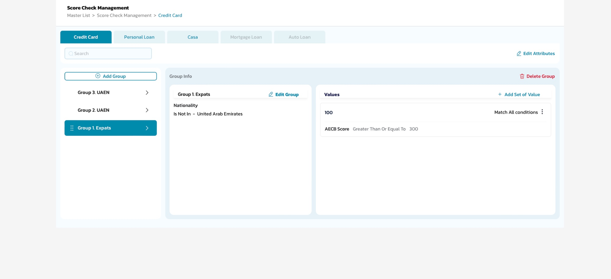
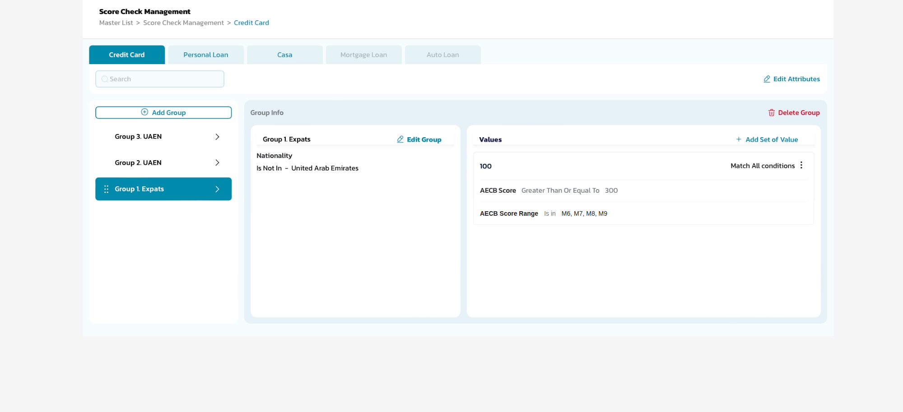

# RF-3329 — [Rule Engine] Update for Score 3.0

Jira: https://scvaladdin.atlassian.net/browse/RF-3329 · Story · Medium · RF project
Written 24 Sep 2026. Jira description is in sync with this file.

### Context of Business

Al Etihad Credit Bureau has issued **Consumer Score 3.0**, which replaces the risk-group scale the
Rule Engine uses today. Score 3.0 splits into two segments — **Mature** (scale 300–850, values
M0–M9) and **New to Credit** (scale 300–650, values N0–N9) — each band carrying a risk group, a
descriptive band and a score range.

Two changes follow. The risk-group value list offered on Rule Engine criteria is replaced by the
Score 3.0 values, and **AECB Score Range** is added as an attribute in Score Check Management,
which today can only test the raw **AECB Score** as a number.

**SC1 — Consumer Score 3.0 mapping (AECB source document)**

**SC2 — Rule Engine value list, current** · *AS-IS*

**SC3 — Rule Engine value list with Score 3.0** · *TO-BE (AC2)*

Composite over the real capture: the list now offers the Score 3.0 codes, shown scrolled to the
M→N boundary so both segments are visible in one list.

**SC4 — Score Check Management, current** · *AS-IS* — only the numeric `AECB Score` can be tested

**SC5 — Score Check Management with AECB Score Range** · *TO-BE (AC3)*

Composite over the real capture: the new attribute sits in the same condition set as the existing
numeric `AECB Score`, which keeps working.

### User Story Details

Scope: **Rule Engine — Strategies (Segmentation, Filtration, Deviation) and Score Check Management,
for the products where Score Check Management is enabled: Credit Card, Personal Loan and CASA.**
Mortgage Loan and Auto Loan tabs are disabled today and are out of scope.

**In-scope scenarios**
* **S1** — Credit user selects an AECB Score Range value on a Strategy criterion.
* **S2** — Credit user adds an AECB Score Range condition to a Score Check Management value set.
* **S3** — An application is evaluated against a strategy using a Score 3.0 value.
* **S4** — A strategy version published under the superseded values is opened or re-published.

**Not in scope**
* Changes to the AECB request or response contract.
* Changes to Limit Assignment boundaries or deviation thresholds.
* Mortgage Loan and Auto Loan (tabs disabled).

### AC1 — Consumer Score 3.0 value list

Both segments are fully contiguous — no gaps or overlaps — so every score in a segment's scale
resolves to exactly one value. (Verified programmatically against the AECB table.)

| Segment | Value | Risk Group | Band | Min Score | Max Score |
|---|---|---|---|---|---|
| Mature | **M0** | Very High Risk | Weak | 300 | 300 |
| Mature | **M1** | Very High Risk | Weak | 301 | 523 |
| Mature | **M2** | High Risk | Fair | 524 | 673 |
| Mature | **M3** | Medium Risk | Good | 674 | 714 |
| Mature | **M4** | Medium Risk | Good | 715 | 740 |
| Mature | **M5** | Medium Risk | Good | 741 | 755 |
| Mature | **M6** | Low Risk | Very Good | 756 | 773 |
| Mature | **M7** | Low Risk | Very Good | 774 | 789 |
| Mature | **M8** | Very Low Risk | Excellent | 790 | 809 |
| Mature | **M9** | Very Low Risk | Excellent | 810 | 850 |
| New to Credit | **N0** | Very High Risk | Weak | 300 | 427 |
| New to Credit | **N1** | Very High Risk | Weak | 428 | 450 |
| New to Credit | **N2** | High Risk | Fair | 451 | 463 |
| New to Credit | **N3** | High Risk | Fair | 464 | 478 |
| New to Credit | **N4** | High Risk | Fair | 479 | 491 |
| New to Credit | **N5** | Medium Risk | Good | 492 | 506 |
| New to Credit | **N6** | Medium Risk | Good | 507 | 519 |
| New to Credit | **N7** | Low Risk | Very Good | 520 | 531 |
| New to Credit | **N8** | Low Risk | Very Good | 532 | 553 |
| New to Credit | **N9** | Low Risk | Very Good | 554 | 650 |

* Displayed as code + risk group, e.g. **M0 – Very High Risk**, matching the existing pattern.
* Mature scale 300–850, New to Credit scale 300–650; resolved against the applicant's segment.
* A score outside the scale, or a missing score, resolves to no value — never defaults to the
  lowest band.

### AC2 — Rule Engine criteria value list
* AECB Score Range offers the Score 3.0 values in place of the superseded list (*1 – Very High
  Risk* … *5 – Very Low Risk*, plus the lettered series).
* **Is in** / **Is not in** operators and multi-select unchanged.
* S4 — published versions are re-mapped to Score 3.0; **the old-to-new mapping is confirmed by
  Credit / Risk before any version is re-published**. No version migrated on an assumed mapping.
* Superseded values are not selectable on a new or edited strategy once Score 3.0 is live.

### AC3 — AECB Score Range in Score Check Management
* **AECB Score Range** available as an attribute alongside the numeric **AECB Score**, on the
  Credit Card, Personal Loan and CASA tabs.
* Usable in a group's Values conditions under Match All / Match Any.
* Operators follow Strategies: **Is in** / **Is not in** over the Score 3.0 values.
* Added through Edit Attributes so it reaches all groups on the product tab.

### Impact Analysis

| Area | Impact |
|---|---|
| **Rule Engine / Strategies** | Value list replaced on every AECB Score Range criterion — Segmentation, Filtration, Deviation. Published versions carry superseded values until migrated (AC2). |
| **Score Check Management** | New attribute on CC, PL, CASA. Existing groups and value sets unchanged; numeric AECB Score keeps working. |
| **Credit decisioning outcomes** | Granularity moves from 5 risk groups to 10 values per segment, so an application can fall on a different side of a threshold. Published strategies to be re-validated before go-live. |
| **New to Credit applicants** | Scale ends at 650 and top band N9 is Low Risk / Very Good — **no Excellent / Very Low Risk band exists**. Any criterion selecting Very Low Risk, or any numeric threshold above 650, can never be met by a New to Credit applicant. Existing thresholds to be reviewed. |
| **Reporting / MIS** | Rule Engine Result and the score in Application Enquiry and reports display the Score 3.0 value; historical applications keep what they were decisioned under. |
| **Audit trail** | Score-check step records the Score 3.0 value and the segment applied. |

### Dependencies

| Ticket | Relationship |
|---|---|
| RF-2136 | Application score card — the scoring stream this sits in; Clarify In Progress. |
| RF-2880 | Score Check Management screen — the surface AC3 changes. |
| RF-2882 | Score Check Management logic and saving — must accept the new attribute. |
| RF-2074 | Strategies attribute list — AECB Score Range sits beside the Lexis Nexis attributes. |
| RF-1931 | Weighted Average Score calculation defect — confirm resolved first. |
| RF-1333 | Credit Queue display of AECB Score — displayed value changes. |

---

## Open with the PO

1. **Old-to-new mapping** — the superseded list has 5 numeric values plus a lettered series;
   Score 3.0 has 10 per segment. Not a 1:1 map, so Credit/Risk must define it. AC2 blocks
   migration until they do.
2. **Segment derivation** — how the system decides Mature vs New to Credit is not in the source.
3. **Numeric AECB Score thresholds** — review every existing threshold above 650 against the
   New to Credit ceiling.
